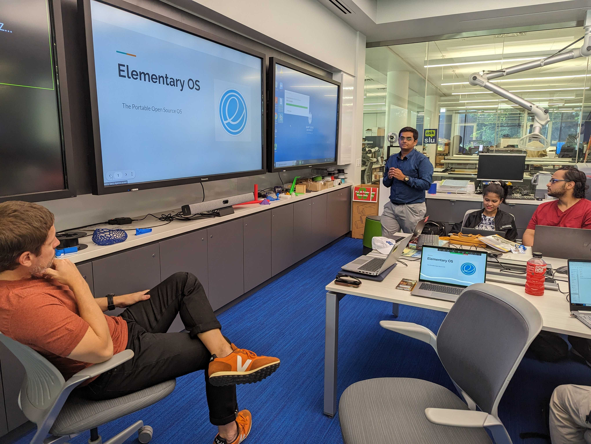
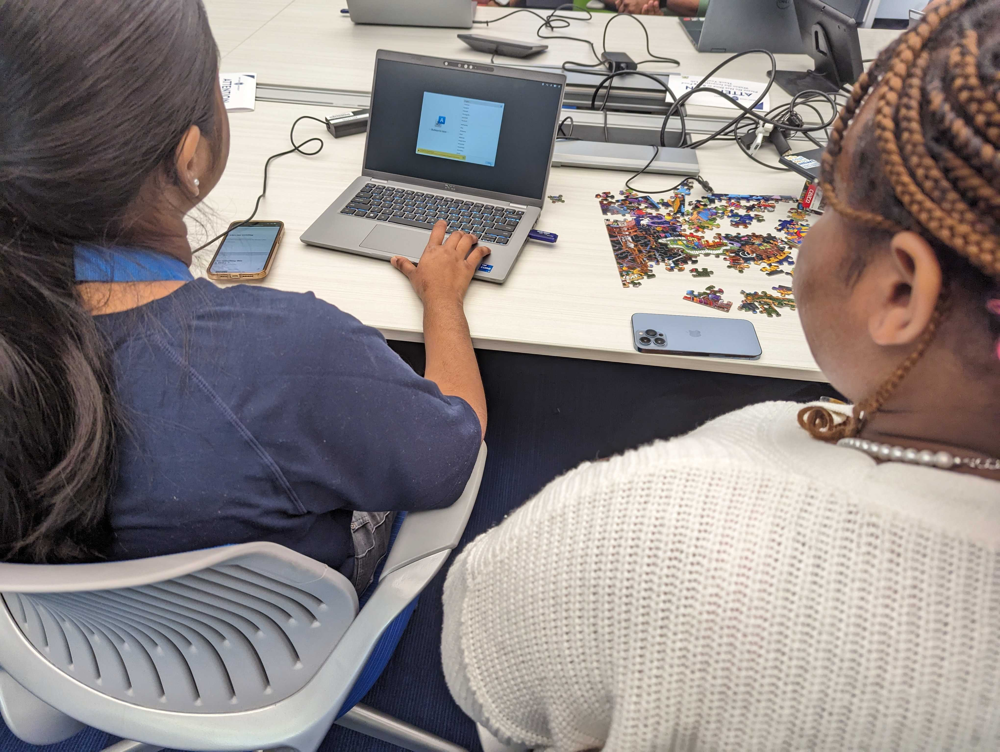
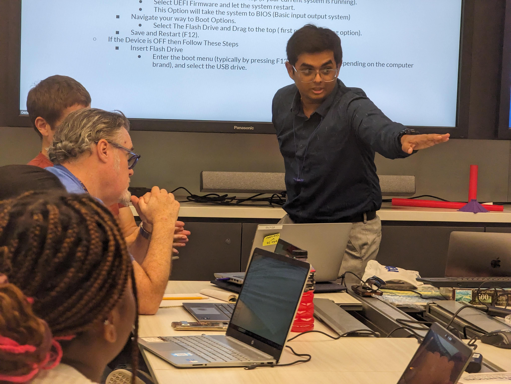
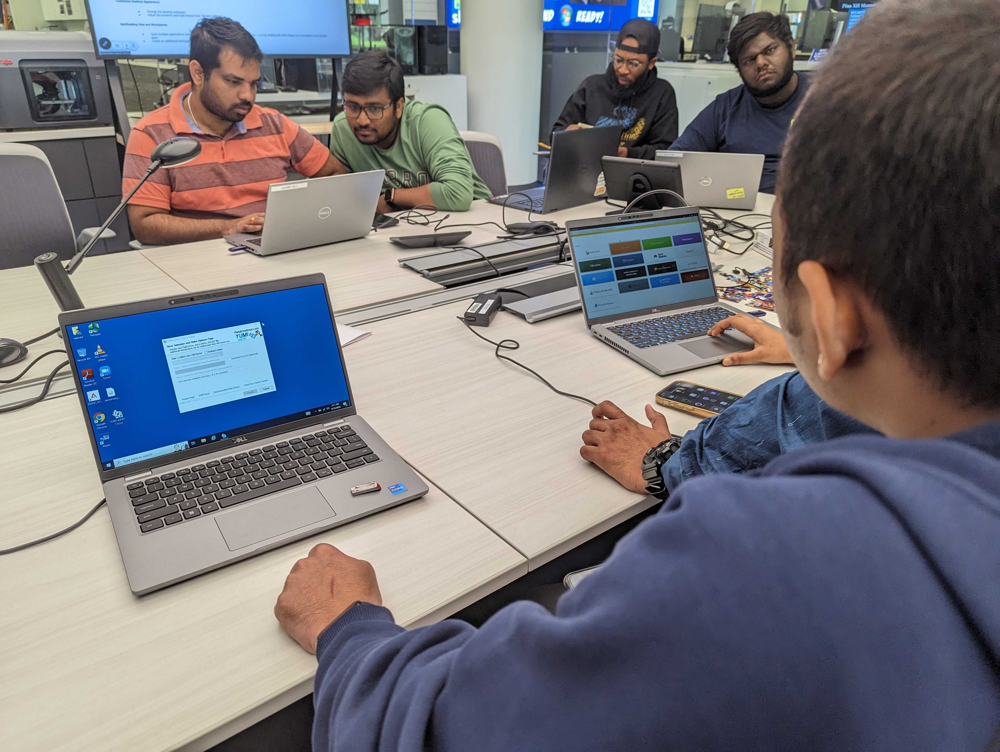
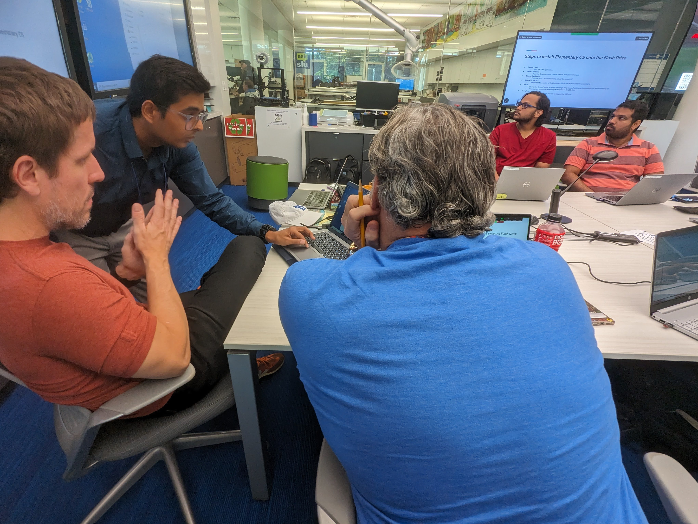

We launched first monthly open source software workshop at the SLU Library's ATC. Students got a hands-on practice creating and using a portable Linux. It was a great success that exceeded the expectations of all the planners. 

<!--truncate-->

**What:** Elementary OS 
**Who:** Presentedy by [Yash Bhatia](https://yashb196.github.io/yashb196/), MS student in Computer Science 
**When:** Friday, September 15 
  1:30-2:30 p.m. (1 hour) 
**Where:** [Pius Library, ATC](https://www.slu.edu/library/services/academic-technology-commons/index.php) 
**Resources:** [presentation of instructions](https://docs.google.com/presentation/d/1QhlBWzoqiha1X8AogqNqMb4jynmaEDOAU2xmdrFD3Cc/edit?usp=sharing)

A group of students and staff huddled over laptops around a large conference table in the Academic Technology Commons of Saint Louis University's Pius Library. The sound of 3D printers hummed in the background. On an already busy Friday afternoon these students had elected to spend their time getting some hands on experiences with open source software. 

Yash Bhatia, a second year Masters student in Computer Science and a Research Assistant with Open Source with SLU, handed out USB flash drives and printed instructions. Then he went [step-by-step](https://docs.google.com/presentation/d/1QhlBWzoqiha1X8AogqNqMb4jynmaEDOAU2xmdrFD3Cc/edit?usp=sharing) with students down the path of creating a bootable flash drive with [elementary OS](https://elementary.io/). Elementry OS is a distribution of the Linux OS that touts itself as "The thoughtful, capable, and ethical replacement for Windows and macOS". Yash then walked those attending the workshop through actually using the flash drive they created as a [portable operating system](https://en.wikipedia.org/wiki/Live_USB). This is a technique where the user can plug and play the entire system on any desktop computer. He walked the group through a variety of use cases for a portable OS, and showed some of elementaryOS's capabilities as a portable operating system.

