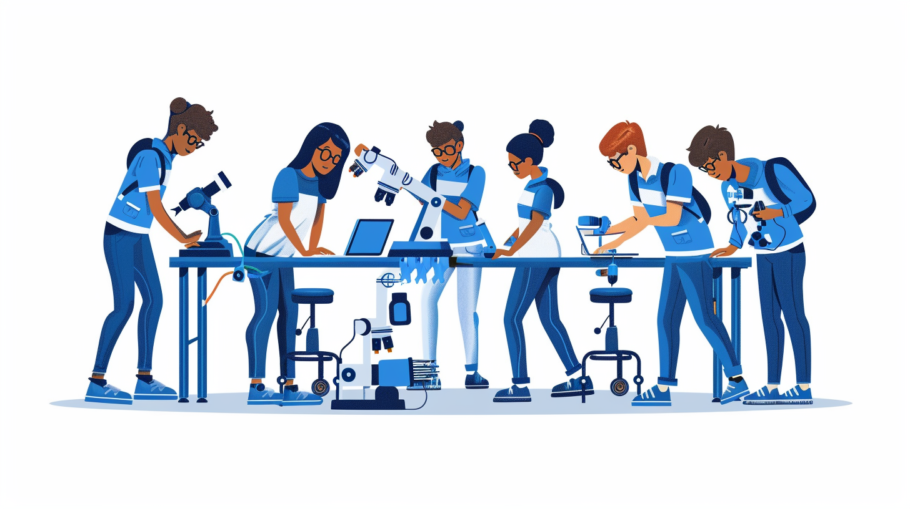

Research labs are filled with real innovation opportunities,  from data acquisition to automation infrastructure. This is your chance to help accelerate discovery.

<!--truncate-->

**What:** $500 Innovation Challenge: [Raspberry Pi](https://www.raspberrypi.org/) Application for Research Support 
**Who:** Saint Louis University students 
**When:** Spring 2024 
**Where:** [Saint Louis University](https://www.slu.edu/admission/visit/index.php) 
**Resources:** [Sign Up](https://forms.gle/r7jb9wb22y1pMqVP9)

Get ready to unleash your creativity and make a real impact to SLU research. We're calling all students to participate in a competition to create applications using [Raspberry Pi](https://www.raspberrypi.org/) technology. Your creations must be game-changers for real research labs. Some examples are: replacing manual work with a [Raspberry Pi](https://www.raspberrypi.org/) based automation, using sensors to collect data, alerting on something, achieving something new, etc.

Here's how it works:

1. Form a Team or Compete Individually
1. Identify an Opportunity
1. [Propose a Solution](https://forms.gle/r7jb9wb22y1pMqVP9)
1. Finalists Announced on [Pi Day](https://www.piday.org/)
1. Build your Solution
1. Win Cash and Glory

## Deadlines

+ [Proposal form submissions](https://forms.gle/r7jb9wb22y1pMqVP9) are due by 11:59pm on March 4.
+ Finalists will be announced on 3.14, [Pi Day](https://www.piday.org/), March 14.
+ Project builds must be submitted by April 22.
+ Winners will bew announced at the SSE Senior Showcase, April 24.
