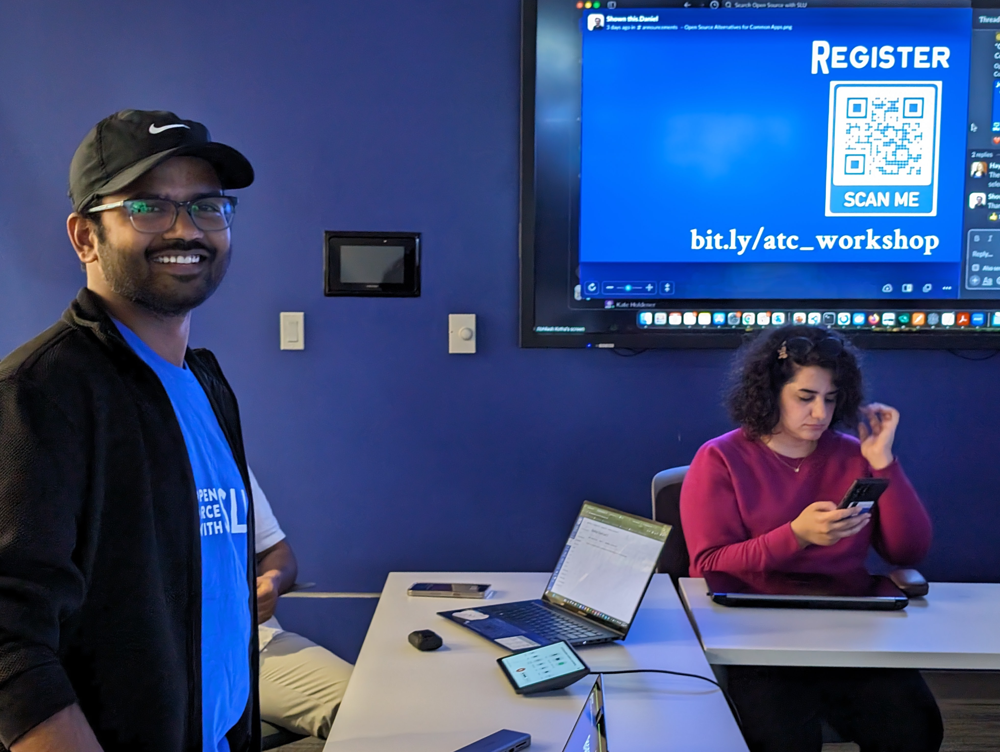
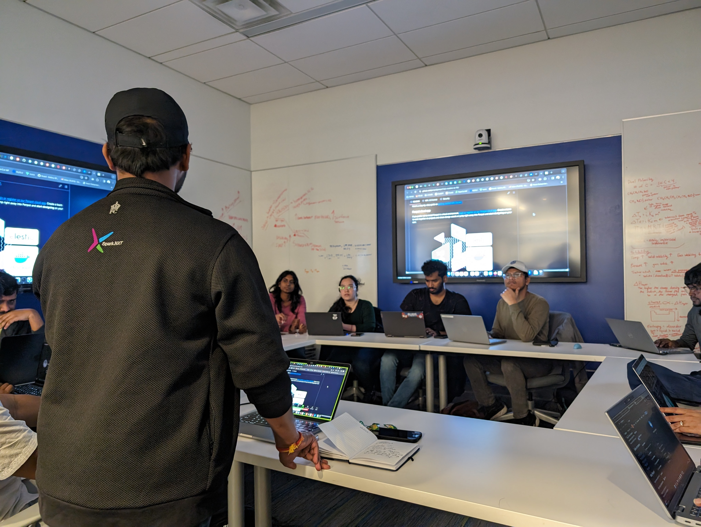

OSS workshop about open source alternatives to everyday tools was conducted at ATC Pius library and it was a great success with 15 curious students joing the session and participating in the live demo. 

<!--truncate-->

**What:** Exploring Open-Source Alternatives to Everyday IT Tools 
**Who:** Presentedy by [Abhilash Kotha](https://yashb196.github.io/yashb196/), MS student in Software Engineering and Graduate Research assistant at OSS SLU 
**When:** Friday, February 09 
  2:00-3:00 p.m. (1 hour) 
**Where:** [Pius Library, ATC](https://www.slu.edu/library/services/academic-technology-commons/index.php) 
**Resources:** [presentation deck](https://drive.google.com/file/d/1fNDAjl_kqJNfBmhCYkUlR2NOnjWYzf6r/view?usp=sharing)

In a recent workshop hosted by Abhilash Kotha, 15 curious students gathered to explore options in the world of open-source software. The workshop, organized by OSS, aimed to shed light on powerful alternatives to everyday tools like browsers, email clients, text editors, and even API testing tools.

The focus wasn't just on functionality but on the core values of open-source: transparency, collaboration, and freedom. By using open-source tools, participants learned about the benefits of knowing exactly what they're using, customizing it to their needs, and contributing to a vibrant community of developers.

The workshop wasn't just theoretical. Abhilash provided a live demo of installing open-source tools directly from GitHub, using their documentation. The audience witnessed the potential of Penpot, an open-source alternative to Figma, and even dabbled with Gpt4all, an open-source interface for open LLM models.

The energy in the room was profound. Participants actively engaged in discussions, asking questions and sharing their own experiences. It was clear that the message resonated, sparking a genuine interest in the possibilities of open-source technology.

<i>"I always knew there were alternatives to tools like Chrome and Outlook but was always afraid to try them. I will definitely try them now,"</i> said Rutvik Mannem, tech lead at OSS, highlighting the positive takeaways.

