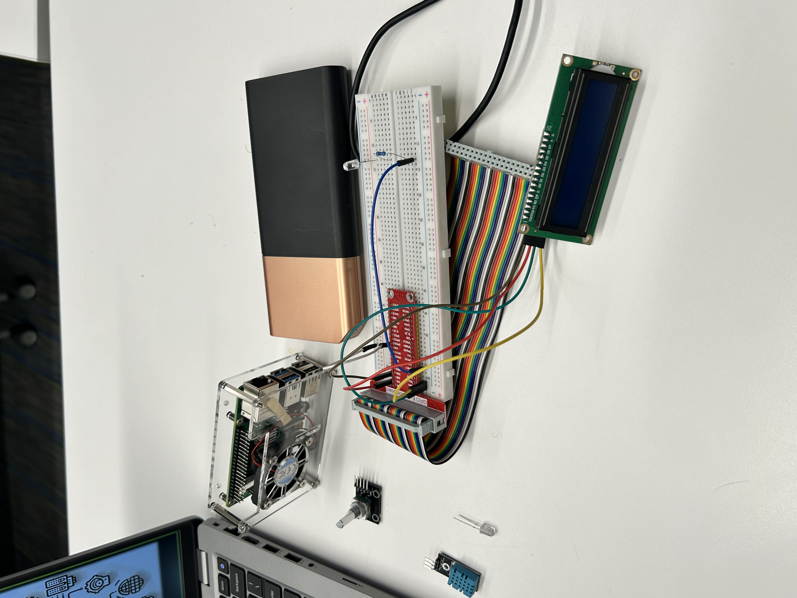
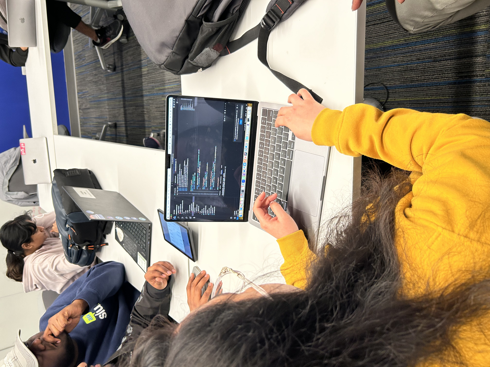

Ruthvik presented the Pi4Micronaut. Students got a hands-on practice using the pi4micronaut library. It was a great success that exceeded the expectations of all the planners. 

<!--truncate-->

**What:** Pi4 Micronaut  
**Who:** Presentedy by [Ruthvik Mannem](https://github.com/ruthvikm), MS student in Computer Science 
**When:** Friday, April 5 
  2:00-3:00 p.m. (1 hour) 
**Where:** [Pius Library, ATC](https://www.slu.edu/library/services/academic-technology-commons/index.php) 
**Resources:** [presentation of instructions](https://oss-slu.github.io/Pi4Micronaut/)

A group of students and staff huddled over laptops around a large conference table in the Academic Technology Commons of Saint Louis University's Pius Library.  On an already busy Friday afternoon these students had elected to spend their time getting some hands on experiences with open source software. 

Ruthvik Mannem, a second year Masters student in Computer Science and a Research Assistant with Open Source with SLU, Explained about how he had created a library for micronaut which worked on Java instead of Python. Then he went [step-by-step](https://docs.google.com/presentation/d/1etn4jDqLUA8tdQhA8emUGaOXri8pRJKu/edit?usp=sharing&ouid=107304909661279551530&rtpof=true&sd=true) with students down the path of installing the libraries and packages to communicate with the micronaut  . The Library does support Ruthvik then walked those attending the workshop through actually using the LED Function along with the Bulb Funcationality they created as a [Example](./oss-atc-20240405/20240405_4.jpeg). 

