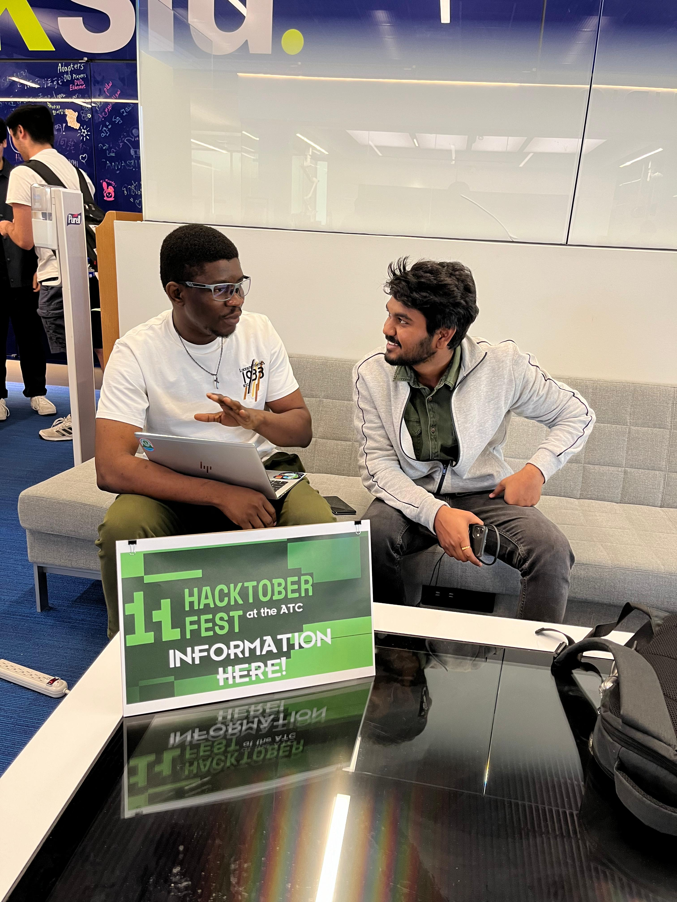

Hacktoberfest is an annual celebration of open source, and at Open Source with SLU (OSS SLU), we embraced it with enthusiasm this year. With over 20 active open-source projects and a community eager to contribute, our team played a vital role in fostering collaboration and engagement. As a tech lead, I had the privilege of hosting an info session to prepare contributors for the event.

<!--truncate-->

**What:** Hacktoberfest 2024 Info Session 
**Who:** Presented by [Victor Ojogbane Onoja](https://github.com/git-voo), Tech Lead at OSS SLU 
**When:** Thursday, October 3, 2024 
  1:00-2:00 p.m. (1 hour) 
**Where:** [Pius Library, ATC](https://www.slu.edu/library/services/academic-technology-commons/index.php)

---

## Preparing for Hacktoberfest Success

Hacktoberfest is all about lowering the barrier to open-source contributions, and our info session was designed to do just that. The event was part of a week-long preparatory series where we supported contributors of all levels. At my session, participants learned to:

- **Set up GitHub accounts**: A key first step for newcomers to the open-source ecosystem.
- **Make projects contribution-ready**: Aligning repositories with Hacktoberfest’s requirements to attract contributors.
- **Navigate challenges**: Addressing common questions, such as resolving merge conflicts and creating effective pull requests.

We focused on creating an inclusive and interactive environment, ensuring participants felt supported throughout the process.

---

## Impact and Highlights

The session was met with enthusiasm, attracting contributors from various backgrounds. Many attendees, who were initially unsure about contributing to open source, left equipped and excited to get started. OSS SLU’s projects also saw immediate engagement from the community, setting the stage for a productive Hacktoberfest.

For me, the most rewarding part was witnessing the “aha” moments when attendees understood concepts like branch management or saw their first pull request merge. It’s a reminder of the power of open source to inspire and connect.

---
## Looking Ahead

Hacktoberfest 2024 has reaffirmed OSS SLU’s commitment to nurturing the open-source community. Beyond October, we’ll continue to champion collaboration and skill development through our projects and events. Whether you’re a seasoned contributor or just starting your journey, there’s a place for you in OSS SLU.

Want to learn more or contribute to our open-source projects? Check out [our repositories](https://github.com/oss-slu) and join the movement!

Together, let’s keep the spirit of open source alive year-round.
