This semester, the *Where's Religion* Desktop and Mobile teams reached an incredible milestone by completing the Minimum Viable Product (MVP) and launching the app's domain live. From refining the user interface to addressing technical challenges, this journey was filled with collaboration and problem-solving.

<!--truncate-->

**What:** Completion of MVP and public launch of *Where's Religion*  
**Who:** The *Where's Religion* Desktop and Mobile development teams  
**When:** Fall Semester  
**Where:** Live across web and mobile platforms  
**Resources:** [Where's Religion Website](https://wheresreligion.org)

*Where's Religion* is a platform that allows users to document and share multimedia annotations of places where religion is encountered in everyday life. With features like interactive mapping, multimedia uploads, and a robust search system, the app bridges faith traditions, cultural insights, and human experiences.

---

### **Key Highlights of Development**

#### **UI and UX Enhancements**

We listened closely to user feedback and made significant updates to improve the app's design and functionality. After meeting with our client, we decided to make several changes to enhance usability and aesthetics. One of the most noticeable changes was updating the homepage and notes page backgrounds to a more vibrant color palette, giving the app a fresh and engaging look. Additionally, we modified the toolbar buttons to create a more uniform design, making them visually appealing and easier for users to navigate.

For onboarding, we implemented an interactive tour to help new users understand the platform. This task was also a great way to give our capstone team the opportunity to familiarize themselves with the project. We chose **Intro.js** as the library for this feature because of its popularity and ease of use. Later, we customized the CSS components of the onboarding tour to make it more visually pleasing and easy to follow, ensuring a smooth and welcoming user experience.

In response to feedback on the notes view, we made significant improvements to how users interact with media. We updated the media component so users can play video and audio files directly within the view, eliminating the need to click on links to access them. Additionally, based on our client's request, we consolidated all media upload functionalities into the editor menu control. This change streamlined the process, enabling users to upload and manage all their media files in one place.


#### **Evolving Media Uploads**

To meet user needs and improve functionality, we completely overhauled the media upload feature. Users can now upload multiple files at once, making the process faster and more efficient. Additionally, we enhanced the annotation tools to allow for tagging and organizing uploads with greater flexibility, helping users manage their content more effectively.

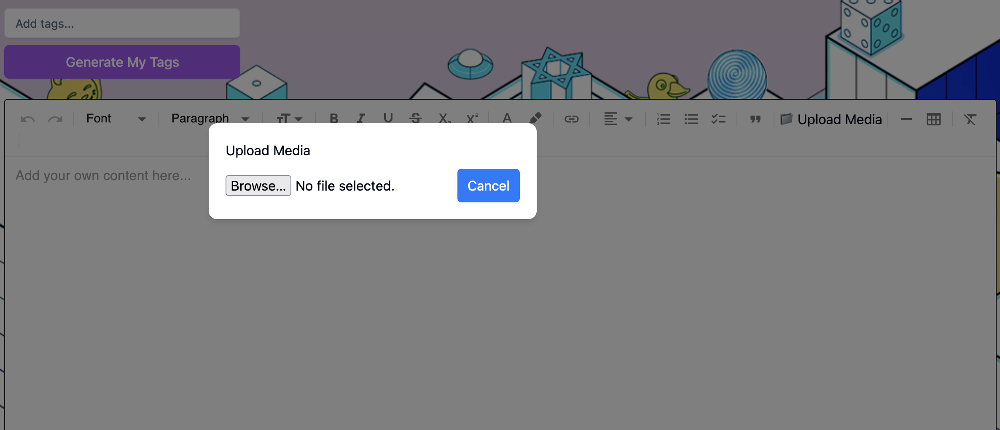

#### **Archiving Instead of Deleting**

While developing the app, we encountered an issue with database relationships that made data deletion problematic. Deleting records caused disconnections between related data, which compromised the app's functionality. To resolve this, we implemented an archiving system instead of outright deletion. This change preserved the integrity of database relationships and allowed users to restore archived data if needed, offering a robust and user-friendly solution.

#### **Fixing Memory Leaks in Test Cases**

Addressing memory leaks in our test cases was one of the most complex challenges we faced. Through a thorough review of previous test implementations, we identified several causes of memory leaks. Unclosed database connections were a significant issue, as were persistent global variables that prevented garbage collection. Circular references between objects and unremoved event listeners also contributed to memory retention. Additionally, timers (`setTimeout`, `setInterval`) that were not cleared after tests caused memory to remain allocated unnecessarily.

To fix these issues, we ensured all database connections were properly closed, event listeners were removed, and timers were cleared after tests. Circular references were refactored to avoid retention, and global variables were scoped appropriately. We used tools such as Jest's `--detectLeaks` flag to identify potential memory leaks and `--detectOpenHandles` to find unclosed resources. The `--logHeapUsage` flag helped us monitor memory usage across test suites, providing insights into patterns of memory growth and areas for optimization. These efforts resulted in more reliable and efficient test cases.

---

### **Impact and Reflections**

Launching the app domain has already had a noticeable impact. Users have embraced the platform's capabilities, and institutions are exploring how they can leverage the tools for their communities. This success is a testament to the hard work and dedication of our teams.

#### **Team Collaboration**

The Desktop and Mobile teams showcased exceptional collaboration throughout the semester. Both teams sat down with our client for live coding sessions, implementing changes in real time while receiving immediate feedback. This iterative process allowed us to refine the app’s features quickly and ensure they aligned with the client’s vision. Together, we also worked on creating Figma designs for the mobile app, collaborating closely with the client to compare the differences between mobile and desktop designs. A key focus during these discussions was how to effectively manage the app's real estate to include as many features as possible while ensuring usability across both platforms. By leveraging each team’s strengths, we resolved bugs and critical issues, enabling a smooth and timely product launch.

#### **Communication**

Effective communication between the Desktop and Mobile teams and with our client played a pivotal role in the project’s success. Regular meetings were held to discuss progress, share ideas, and address challenges collaboratively. These discussions enabled both teams to synchronize workflows, share updates on design decisions, and identify ways to integrate features across platforms seamlessly. Additionally, we presented our ideas for future app implementations to the client, incorporating their feedback to refine our roadmap. This transparent and dynamic communication process ensured that everyone involved was aligned with the project’s goals and priorities.

#### **Fostering Open Source Community**

In addition to launching the app, our team worked to foster a sense of community within the Open Source with SLU program. By involving the client in live feedback sessions and collaborative design discussions, we demonstrated the value of open-source principles—transparency, collaboration, and user-driven development. Sharing our design choices, such as how to adapt the app's features to mobile platforms while maintaining functionality, also highlighted our commitment to creating a tool that serves diverse user needs. This approach not only strengthened our relationship with the client but also showcased the collaborative potential of open-source development to the broader SLU community.

#### **Mobile vs. Desktop Design Comparison**

| **Mobile Map View**                                           | **Desktop Map View**                                            |
|---------------------------------------------------------------|-----------------------------------------------------------------|
| 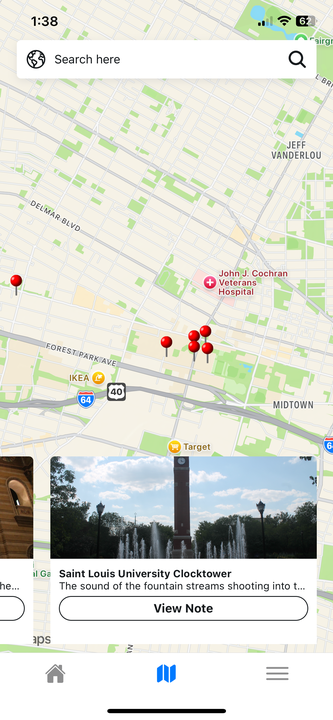 |  |

| **Mobile List View**                                          | **Desktop Map View**                                            |
|---------------------------------------------------------------|-----------------------------------------------------------------|
| 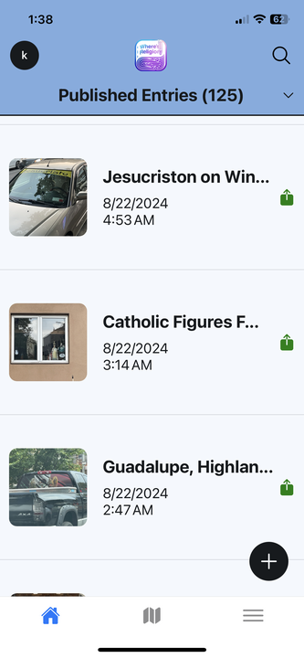 |  |

| **Mobile About View**                                         | **Desktop About Views**                                         |
|---------------------------------------------------------------|-----------------------------------------------------------------|
| 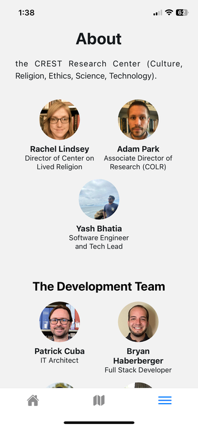 | 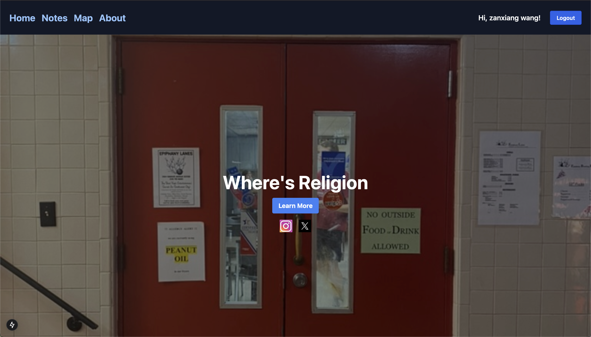  |

---

### **Lessons Learned**

Through this project, we learned the importance of prioritizing user feedback and iterating quickly to address it. Building for scalability from the start allowed us to reduce technical debt and create a more robust foundation for future growth. Additionally, embracing challenges as opportunities for learning and innovation enabled us to deliver a better, more user-friendly platform.

---

### **Looking Ahead**

While this semester’s achievements are monumental, we are just getting started. Our roadmap includes ambitious plans to enhance the platform further:

- We are exploring adding animations to the homepage to make it more dynamic and engaging for users.  
- A complete redesign of the user interface is in the works to make it more visually appealing and intuitive.  
- We plan to implement custom scripts that will automatically convert all uploaded media files to standardized formats: audio to MP3, video to MP4, and images to JPEG.  
- Modifications to how location information is displayed to users during the note creation process are planned to ensure clarity and ease of use.  
- A new design for the publishing toggle is in development to provide a more user-friendly and visually consistent experience.  
- Completing the About page is a top priority, as it is still in progress and will provide users with insights into our vision, mission, and team.

We’re proud of what we’ve built and excited to continue growing *Where’s Religion* into a tool that enriches the way people experience and document their encounters with religion.

### **Key Highlights of Development**

---

### **Karthik’s Contributions as a Tech Lead**

As the tech lead for the **Where's Religion Mobile app**, I was able to engage in some of the most essential and demanding aspects of the project. My duties included problem-solving, user experience design, open-source promotion, and leadership. Here are several of my main contributions to the project.

---

### **Enhancing Navigation with Redux State Management**

This approach eliminated the need for manual updates to local storage and ensured that user actions, such as completing onboarding or logging in, would immediately trigger a state change. This solution improved the app's performance and user experience significantly.

To resolve this, I implemented **Redux for global state management**. By creating a **user slice**, I ensured the app's navigation state was updated in real time. I designed the system to track user states like **"loading," "onboarding," "login," and "home"** and created a smooth flow for the onboarding process.  

Here’s an example of the Redux slice I created:  

```typescript
import { createSlice, PayloadAction } from '@reduxjs/toolkit';

interface NavigationState {
  navState: 'loading' | 'onboarding' | 'login' | 'home';
}

const initialState: NavigationState = {
  navState: 'loading', // Default state
};

const navigationSlice = createSlice({
  name: 'navigation',
  initialState,
  reducers: {
    setNavState(state, action: PayloadAction<'loading' | 'onboarding' | 'login' | 'home'>) {
      state.navState = action.payload;
    },
  },
});

export const { setNavState } = navigationSlice.actions;

export default navigationSlice.reducer;
```
---

### **Hacktoberfest and Open Source Contributions**

In addition to my development responsibilities, I contributed to supporting the open-source community. As part of Hacktoberfest, I created and documented issues related to the Where’s Religion mobile app, ensuring they were clearly described to make it easier for contributors to understand and tackle them. I also took an active role in supporting students during the Hacktoberfest initiative by volunteering at the university library, where I guided students on how to contribute to open-source projects. Through these efforts, I played a key role in fostering community engagement and encouraging collaboration on the Where’s Religion mobile app.

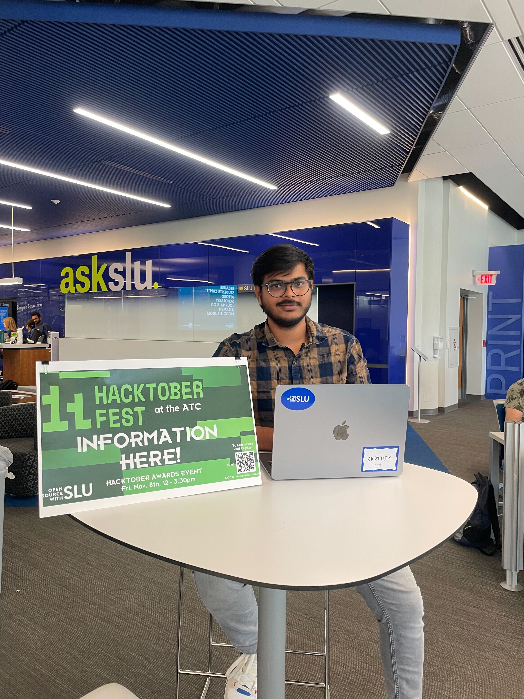

---

### **Creating and Implementing Figma Designs**

When I joined the team, the app did not have a clear design or style guide. To bridge this gap, I worked closely with our client, **Dr. Park**, to understand his vision and requirements. After several meetings, I created a **Figma design** that aligned with both the client’s needs and the app's functionality.

I started by creating the Figma designs for the mobile app, ensuring they aligned with the client’s requirements and project goals. After several discussions with Dr. Park, I developed a comprehensive design that focused on enhancing navigation, layout, and aesthetics. These designs were well-received by Dr. Park.

At present, I am actively converting these Figma designs into fully functional mobile app interfaces using React Native. This development process commenced on December 6, 2024, and by December 7, 2024, I had successfully completed 40% of the required screens. My objective is to ensure that the screens are not only entirely responsive but also visually consistent with the Figma designs and optimized for a seamless user experience. This transition from design to development allows me to maintain the original design vision while delivering a polished, high-quality product.

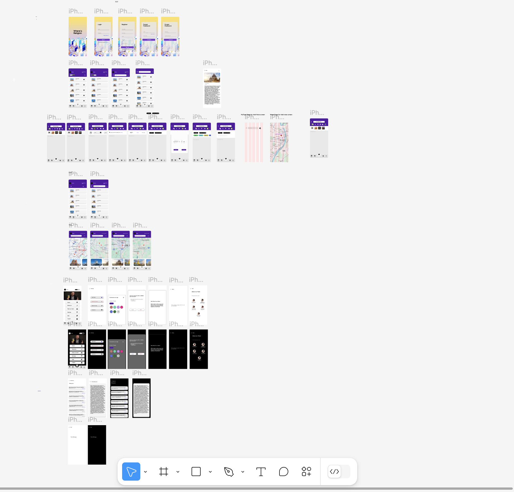
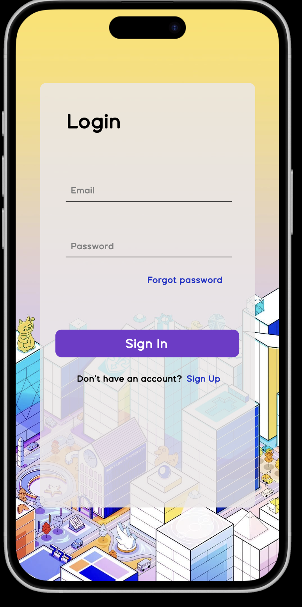
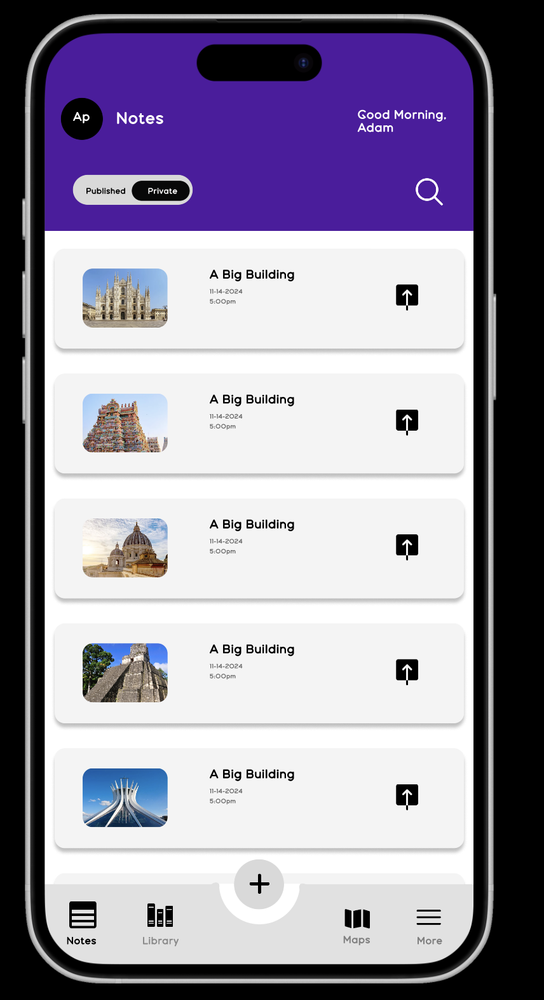
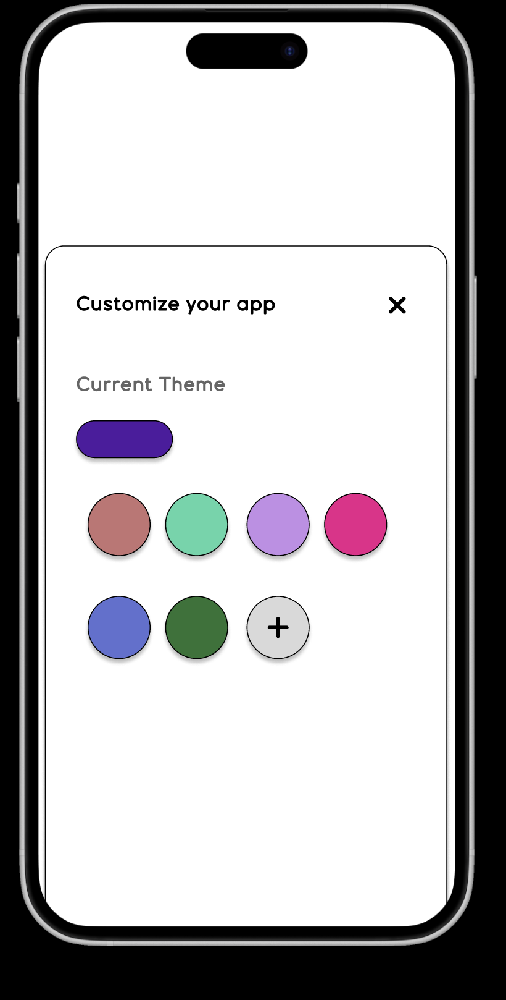

---

### **UI and Styling Improvements**

Throughout the semester, I worked on several **UI and styling issues** to improve usability and consistency across the app. Here are some of the key changes I made:

#### **Search Bar and Dropdown Menu Alignment**
The search bar and dropdown menu were overlapping when both were active, creating a cluttered user experience. I resolved the issue by modifying the layout and styling to ensure the two components were visually distinct and properly aligned.

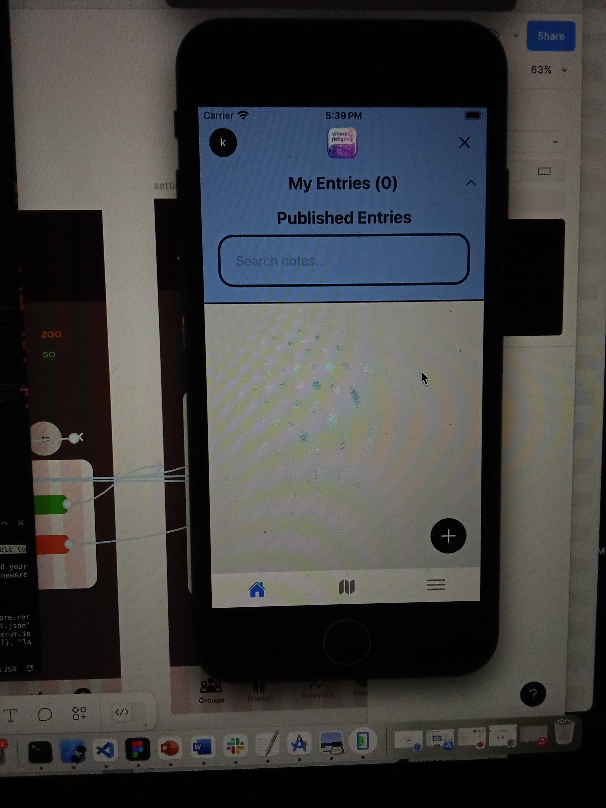

#### **Login and Sign-Up Page Enhancements**
To improve clarity, I reworked the **login and sign-up pages**. I repositioned the **"Forgot Password"** link and replaced the **"Register"** button with a new call-to-action:  
> **"Don't have an account? Register."**

This update made the registration process more intuitive for new users.

---

### **Impact and Reflections**

Working as a **tech lead** for **Where’s Religion Mobile** has been a rewarding experience. I’ve had the opportunity to lead development, improve navigation, and contribute to UI/UX design. My role also extended to supporting **open-source contributions** and creating Hacktoberfest issues to encourage collaboration.

Currently, I am focused on converting Figma designs into operational mobile app interfaces using React Native. This development phase started on December 6th, 2024, and by December 7th, 2024, I had successfully completed 40% of the required screens. The goal is to deliver a modern and seamless user experience with enhancements to navigation, layout, and overall usability. I am dedicated to ensuring that the implementation remains true to the original design vision, resulting in responsive and fully functional mobile app screens. I look forward to completing this phase in the coming weeks while maintaining high standards of design fidelity and user experience.

This project has taught me the importance of problem-solving, open-source advocacy, and collaboration. I’m especially grateful for the opportunity to work with **Dr. Park**, **Yash Kamal Bhatia**, and the entire **Where's Religion** team.

---

### **Lessons Learned**

Through this project, we learned the importance of prioritizing user feedback and iterating quickly to address it. Building for scalability from the start allowed us to reduce technical debt and create a more robust foundation for future growth. Additionally, embracing challenges as opportunities for learning and innovation enabled us to deliver a better, more user-friendly platform.

---

### **Looking Ahead**

While this semester’s achievements mark a significant milestone, our journey is far from over. We have an ambitious roadmap ahead to further enhance the mobile app:

- Improving navigation and layout consistency across screens for a seamless user experience.
- Adding interactive animations to make the mobile app more dynamic and engaging for users.
- Refining the note creation process to make location data entry simpler and more intuitive.
- Enhancing the mobile app's performance and responsiveness across different devices and screen sizes.
- Implementing accessibility features to make the app more inclusive and user-friendly for all users.

We take pride in the advancements we've achieved and are eager to keep developing Where's Religion into a platform that enables individuals to engage with and record their experiences of religion via mobile devices.
