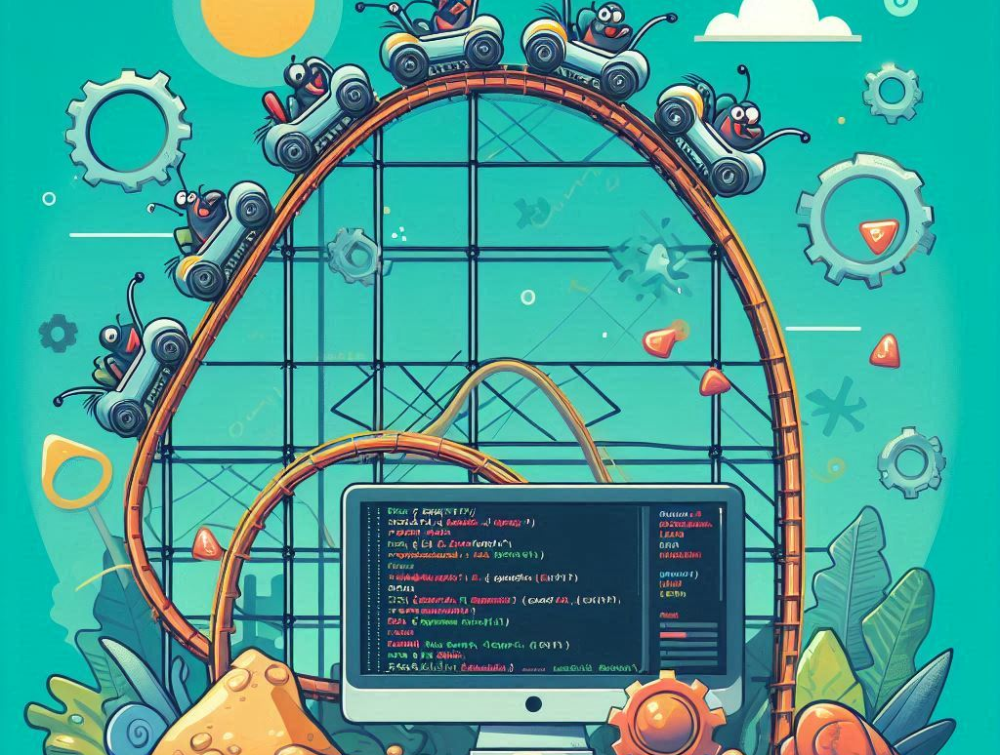
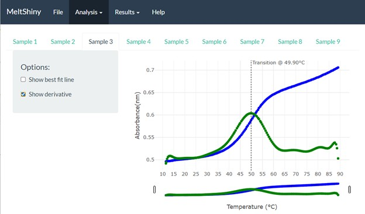
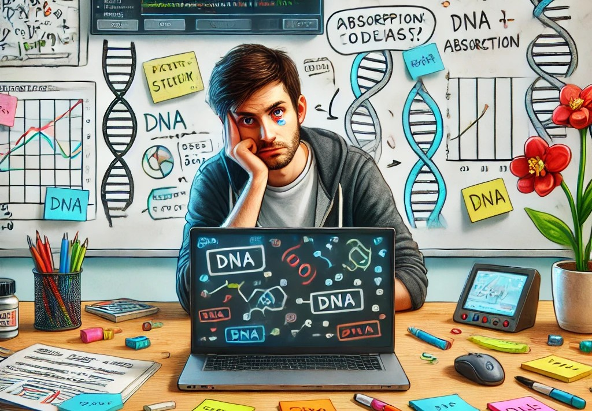

Ever had one of those days when everything seems to be falling into place, and then suddenly—bam!—a bug or a roadblock makes you question your life choices? If you’ve ever worked in open-source projects, you probably know exactly what I’m talking about. Welcome to my journey with MeltShiny, where I learned, struggled, laughed, and most importantly—coded my way through some pretty interesting challenges.

<!--truncate-->

Let’s dive into what makes this project unique, what I learned along the way, and the lessons I’ll carry forward (besides learning how to type `git commit -m` in my sleep).

## MeltShiny

It all started when I found myself caught up in a project that seemed like the perfect mix of creativity and technicality. MeltShiny isn’t just any project; it’s a Shiny app built to analyze data and present it in a way that makes complex biological information accessible for researchers. Think of it as a magnifying glass for DNA and RNA absorption data—transforming raw numbers into understandable graphs, charts, and reports. It was like the equivalent of turning a boring biology lecture into a lively dance performance.

But like all good projects, MeltShiny didn’t come without its challenges.

## My Journey – A Blend of Code, Chaos, and Collaboration

From the get-go, I realized that open-source projects are never as smooth as they seem. Whether it was handling complex data formats, tweaking the user interface, or figuring out how to make the Help section interactive and helpful, there was never a dull moment.

I remember my first hurdle: ensuring the app worked seamlessly across different samples. For instance, the meltR package was smooth sailing with Sample 1 and 2, but Sample 3? It was like trying to fit a square peg in a round hole. But instead of letting it get the best of me, I merged the changes that worked for the first two and tackled the Sample 3 issue with a new issue tracker. And yes, it worked!

**Lesson #1:** Adaptation is key, and embracing the unexpected is half the battle.

## Difficulties? Oh, We Have Those!

Let’s not sugarcoat it. There were some grueling days working with MeltShiny. From debugging unexpected errors to ensuring all elements of the app were working together smoothly, it wasn’t always a walk in the park.

One major challenge was dealing with the meltR package. While it worked flawlessly for Sample 1 and 2, integrating Sample 3 became a puzzle. The differences in data formats, combined with the app’s dependence on specific assumptions, meant that resolving the issue wasn’t as simple as just plugging in new data. It was more like trying to solve a riddle, but every time I thought I had the answer, a new twist would emerge.

But instead of throwing in the towel, I chose to merge the successful parts, focusing on what worked for Samples 1 and 2. The Sample 3 issue got its own dedicated branch, so we could fix that without disrupting the rest of the project. This taught me the power of separation of concerns—sometimes, you need to isolate problems to make solving them easier.

Another area that demanded constant attention was UI and UX. The goal was to create an app that was not only functional but also easy for researchers to navigate. While the app’s logic was solid, translating that into a clean and intuitive interface was no small feat. Whether it was figuring out how to display complex data in digestible formats or making sure buttons and dropdowns were user-friendly, UX design became its own adventure.

## Collaboration: The Team Makes the Dream Work

One of the best parts of this journey was working with the Open Source with SLU team. The collaboration was something else. From brainstorming sessions to sprint evaluations, the feedback loop was incredibly enriching. Every retrospective gave us a chance to not just analyze what went right, but what went wrong (and how we could laugh at it—because what's coding without some humor, right?).

The Team Working Agreement was the backbone of our project management. It wasn’t just about coding standards and practices (though we did have a killer GitHub workflow). It was about communication—being proactive, responding timely, and supporting each other when the road got rough. This approach transformed our development process from mere code production into a community effort.

And let's talk about the sprints. They were like rollercoaster rides—some high-speed moments where everything clicked, and others where you had to close your eyes and hope for the best. Every sprint was a chance to evaluate how far we’d come, what needed fixing, and how to make the process smoother. And at the end of every sprint, we celebrated our small wins, even if they were just fixing one bug.

## Sprinting Towards the Finish Line

One of the highlights of my journey was our sprint evaluations. It wasn’t just a “let’s see what we’ve done” moment. It was more of a “let’s look at the road ahead” scenario.

We worked hard to make sure the Help Section was user-friendly, adding interactive features that guide users through their journey with the app. Every line of code was aimed at improving user experience—and guess what? It worked. After all, user experience isn’t just about making things work; it’s about making them enjoyable. And that’s the goal we set out to achieve.

## Reflecting on the Journey

Looking back, the journey feels a little like a movie script. We had our fair share of drama (the debugging crises), comedy (when we realized we made an accidental change and it fixed half of our problems), and action (the sprint deadlines). But in the end, it was a team effort, and that’s what made it all worthwhile.

I’ve learned a lot, not just about coding and problem-solving, but about collaboration, communication, and adaptation. I’ve come to realize that open-source projects are like puzzles: you might not get it right at first, but the more you work with others, the clearer the pieces start to fall into place.

## Where to Next?

The journey isn’t over—MeltShiny is still evolving. We’re going to keep improving, keep adding features, and keep listening to feedback. Our next goal? Making the app even more scalable and efficient.

If you want to join the fun or contribute, the MeltShiny GitHub repository is always open for your contributions. Whether you're a newbie or a seasoned pro, there's always room for more hands on deck.
