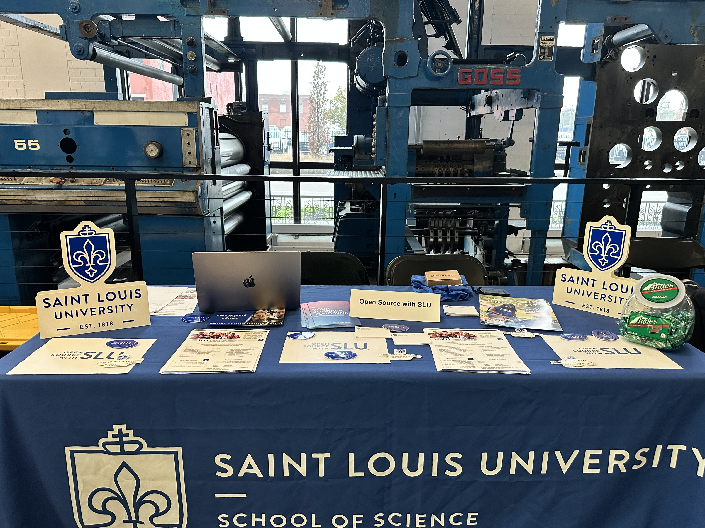

The **Saint Louis Startup Connection** event ([official website](https://www.stlouisstartupweek.com)) offered an incredible atmosphere for anyone passionate about innovation, entrepreneurship, and community building. This was my first time attending such a gathering, and I had the opportunity to represent **Open Source SLU**, an experiential learning program aimed at developing real world software solutions and fostering software development skills among graduate and undergraduate students.

<!--truncate-->

I wasn’t entirely sure what to expect when I first walked into the heart of downtown Saint Louis, but I quickly realized I was in the right place. The venue, a beautifully restored old printing press building, merged modern design with historical industrial elements—giant, preserved printing machines stood as works of art, setting a unique and inspiring stage for the event.

Dozens of startups, many of them bootstrapped and just getting off the ground, were showcased at tables throughout the space. Their products and services spanned a wide range of fields, from cultural innovations to cutting-edge technology solutions. The air was buzzing with excitement, curiosity, and a shared passion for building something new and meaningful. Food, drinks, and various freebies added a warm, welcoming touch.

Being at the **Open Source SLU** table gave me a front-row seat to conversations with founders, venture capitalists, and enthusiastic innovators. I was there to spread the word about our mission: to help students gain real-world software development experience while delivering meaningful solutions. One of the projects I’m proudest of is “**BubbleScan**,” which I lead alongside three colleagues. Explaining our work to people who genuinely cared about innovation felt incredibly rewarding.

In between conversations, I ventured around the room, soaking in the diversity of ideas. Startups presented everything from AI-powered tools to cultural initiatives addressing societal issues. Each table had its own story, and each entrepreneur spoke with passionate conviction. It was a vivid reminder that the entrepreneurial spirit can solve many kinds of problems—technical, social, and beyond.

At some point during the event, I even got to meet a venture capitalist who was interested in what we were doing. We connected, exchanged insights, and discussed potential collaborations.

This handshake, captured in the Instagram post above, symbolizes the bridges being built—between students and industry, between ideas and resources, and between present challenges and future opportunities.

By the end of the day, I walked away with new contacts, a broader perspective, and a renewed sense of confidence. The **Saint Louis Startup Connection** is more than an event—it’s a thriving ecosystem where ideas are nurtured, and partnerships are born. If you ever have the chance to attend something like this, especially if you’re new to the startup world, seize it. The inspiration, knowledge, and relationships you gain are invaluable stepping stones on any entrepreneurial journey.
