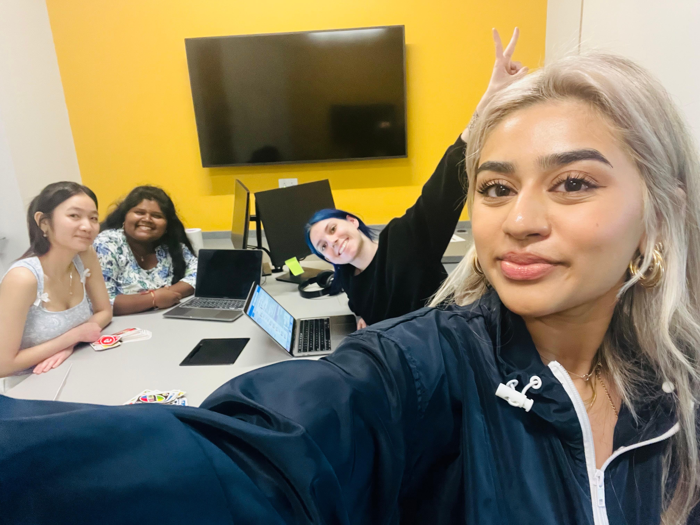

Building a project that aims to help others is always a rewarding experience, but it’s not without its challenges. My journey with the Shelter Volunteers project, a tool designed to streamline volunteer scheduling for homeless shelters, was no exception. Along the way, I learned new technical skills, faced unexpected hurdles, and collaborated with an amazing team. Let me take you through this journey.

<!--truncate-->

## Shelter Volunteers

Shelter Volunteers started as an idea to make the process of managing volunteer shifts easier, especially in emergency situations like inclement weather. The goal was to build an app that would allow homeless shelters to easily manage volunteer schedules, and for volunteers to quickly sign up for shifts or reschedule them as needed. It’s a simple idea with a big impact: ensuring that the shelters are properly staffed and the volunteers are well-coordinated.

But as with any development project, the road to completion was full of learning experiences and unexpected twists.

## The Development Journey – From Concept to Code

From the very beginning, I knew that this project wasn’t going to be a walk in the park. There were multiple components to tackle—both backend and frontend. The project uses a Flask server to manage the scheduling data and APIs, while the frontend uses React to display the interface. MongoDB is the database of choice to store the volunteer and shift data.

One of the first challenges I encountered was integrating real-time scheduling functionality. Volunteers needed to see the most up-to-date shift availability, and shelters needed to adjust staffing needs based on urgent requests. This required careful planning and integration between the frontend and backend to ensure smooth data fetching and updates.

**Lesson #1:** The importance of real-time data syncing cannot be overstated.

## Collaboration – A Team Effort

One of the most rewarding aspects of the project was working with an incredible team. As a tech lead, I guided a group of three developers who worked on different parts of the app. We used GitHub for version control and project management, and the teamwork was key to moving the project forward.

In addition to regular coding sprints, we held retrospectives and feedback sessions where we discussed what went well and what could be improved. These sessions not only helped us identify bottlenecks but also fostered a positive, open communication environment.

**Lesson #2:** Collaboration and feedback loops are crucial for success, especially in open-source projects.

## Team Outing – Celebrating Our Success

In the middle of the project, our team decided to take a well-deserved break to celebrate the progress we had made so far. We had a great time during our team outing, reflecting on the project and enjoying each other's company outside the work environment. It was the perfect way to unwind, recharge, and strengthen the bond we had built throughout the development process.

Our outing was a reminder that working together as a team is not just about coding, but also about building lasting relationships and supporting each other through every phase of the project.

## The Final Presentation

After months of development, testing, and refining, we reached the milestone of the final presentation for the Shelter Volunteers project this semester. This was an opportunity for us to showcase the progress we've made, share the impact achieved so far, and discuss the future goals of the project.

During the presentation, we highlighted the key features we had developed, including the volunteer scheduling functionality, the shelter staff dashboard, and the real-time updates for urgent staffing needs. We also had the chance to invite our client to see the progress and discuss how the project could continue to support their operations moving forward.

While this presentation marked the end of our semester's work, we are excited to continue refining and expanding the project in the next semester.

## Reflecting on the Journey

Looking back at the entire development process, I realize how much I’ve learned—both from the technical challenges and the teamwork dynamics. It wasn’t just about writing code; it was about solving real-world problems and working together to create something meaningful.

The experience of leading a project like Shelter Volunteers has taught me the importance of clear communication, adaptability, and maintaining a focus on user needs. The client’s feedback helped us see how the app could make a difference in the daily operations of shelters, and that made the entire journey worthwhile.

## What’s Next?

The journey doesn’t end here. While Shelter Volunteers is in a good place, there’s always room for improvement. The next steps for the project involve scaling it, improving security, and adding features like notifications for volunteers and staff. We’re also exploring ways to make the app more efficient and scalable for larger shelters.

If you’re interested in contributing to the Shelter Volunteers project or want to see how it works, feel free to check out the [GitHub repository](https://github.com/oss-slu/shelter_volunteers).

---

**Lessons Learned:**
- Real-time data syncing is crucial.
- Building an intuitive, mobile-first UI is key for accessibility.
- Collaboration and feedback are essential for success.
- Presenting to a client and getting feedback is an incredibly rewarding part of the process.
