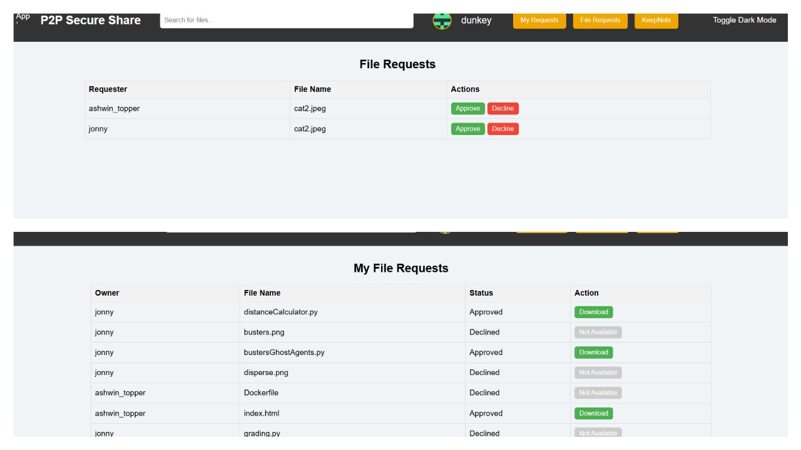
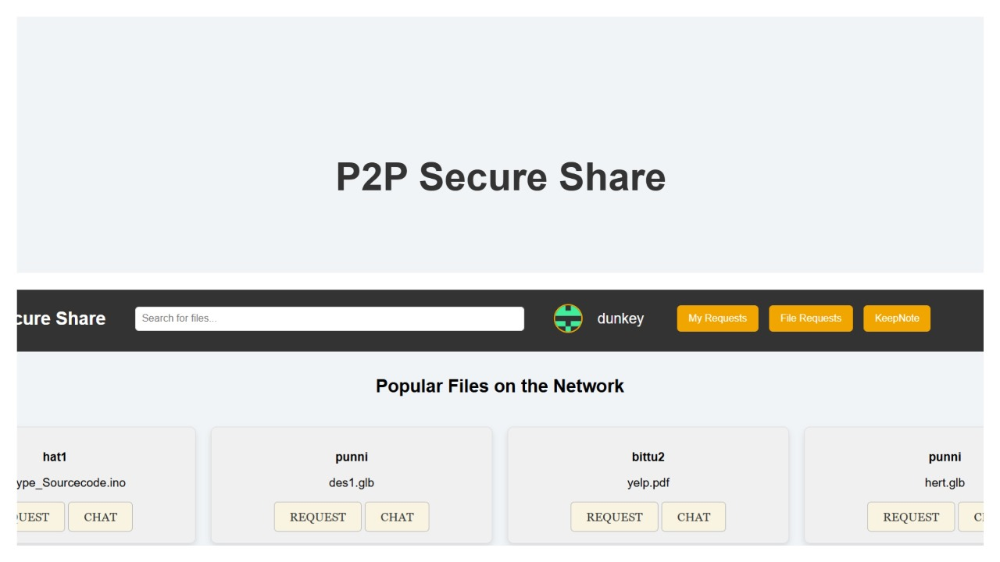

At the heart of our development journey, we believe open source is our way forward. The idea of creating software that is accessible for everyone, collaborative, and constantly evolving is something we strongly resonate with. This belief has led us to embark on a project that blends our passion for technology with our commitment to privacy, security, and community-driven development.

<!--truncate-->

### **Building a P2P File Sharing Application**
As part of our networking course, we decided to build a file sharing application using peer to peer (P2P) networks. We identified a gap in traditional P2P applications when it comes to privacy and security.
In conventional P2P networks, peers often have limited authentication, and there's no control over the file transfer once a peer knows how to locate a file. If a peer finds a file, they can download it directly without any oversight. We felt that this model wasn’t secure enough
                                                                       
### **Our Solution: Giving Peers More Control**
Instead of allowing a direct download of files, we introduced an option for peers to have more control over the transfer process. We wanted users to have the ability to decide which files they want to share and ensure that only specific files are visible to other peers on their devices.
To achieve this, we implemented an authentication process, requiring all users to authenticate before becoming peers. This added a layer of security, ensuring that only authorized users could participate in the network. We also developed an interface that allows users to manage incoming and outgoing file transfer requests, further enhancing their control over the process.

### **Testing and Feedback**
Once we developed the application, we tested it with a variety of file transfers and all were successful. Our professor praised the project, calling our approach unique and innovative.
Many of our peers also expressed their frustration with traditional P2P applications, which often come with security risks and inappropriate ads. They were also bothered by bundled software : setup files that are downloaded along with an application but have nothing to do with the file-sharing process. We realized that our application could address these issues and offer a more secure and user-friendly experience.

---
