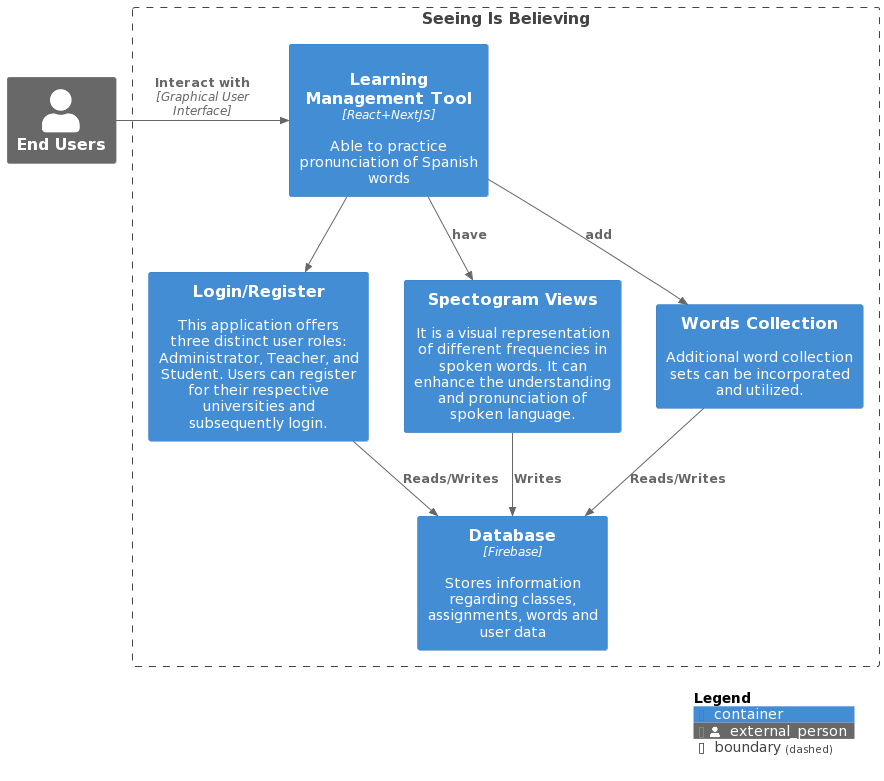

## Overview

 The objective of this project is to create an educational learning tool enabling teachers to showcase the pronunciation of Spanish words. Students can use this application to practice pronunciation, observing their improvement through a compilation of spectrograms.

### Information

- **Source Code:** <https://github.com/oss-slu/Seeing-is-Believing>
- **Client:** Dr. Christina Garcia, Saint Louis University
- **Current Tech Lead:** [Sailikhita Pulijala](https://github.com/LikhitaPulijala)
- **Developers:**

  - [Halima Malik](https://github.com/HalimaMalik) (alumni)
  - [Sivaprasad Vishnu](https://github.com/sivaprasadvishnu18) (alumni)
  - [Carlos Salinas](https://github.com/carlossalinas6) (alumni)
  - [Daniel Mao](https://github.com/danmao1) (alumni)
  - [Anna Kidwell](https://github.com/akidSLU) (capstone)
  - [Owen Thomasson](https://github.com/OwenAThomasson) (capstone)
  - [Miles Monday](https://github.com/mmonday0) (capstone)

- **Start Date:** July 12, 2022
- **Adoption Date:** July 12, 2022
- **Technologies Used:**
  - React
  - NextJS
  - Firebase
- **Type:** Web Application
- **License:** [GNU General Public License v3.0](https://opensource.org/license/gpl-3-0/)

## Users

This application provides login and registration features, offering three distinct roles: Admin, Teacher, and Student. Teachers can manage classes, add homework, and access the words library. Students can practice words, check grades, and view homework assignments. Admins have full access to the entire application, including all modules.

## Technical Information

### Overview

Overview of the software architecture.

### Development Priorities

- Need modern versions of npm,node and react
- Must have local environment setup
- Responsive Design and User Experience (UX)
- Add automated testing
- Version Control and Collaboration
- Performance Optimization

## Get Involved

If you would like to contribute to this project, please visit our [GitHub page](https://github.com/oss-slu/Seeing-is-Believing) to create your own issues or pull requests.
