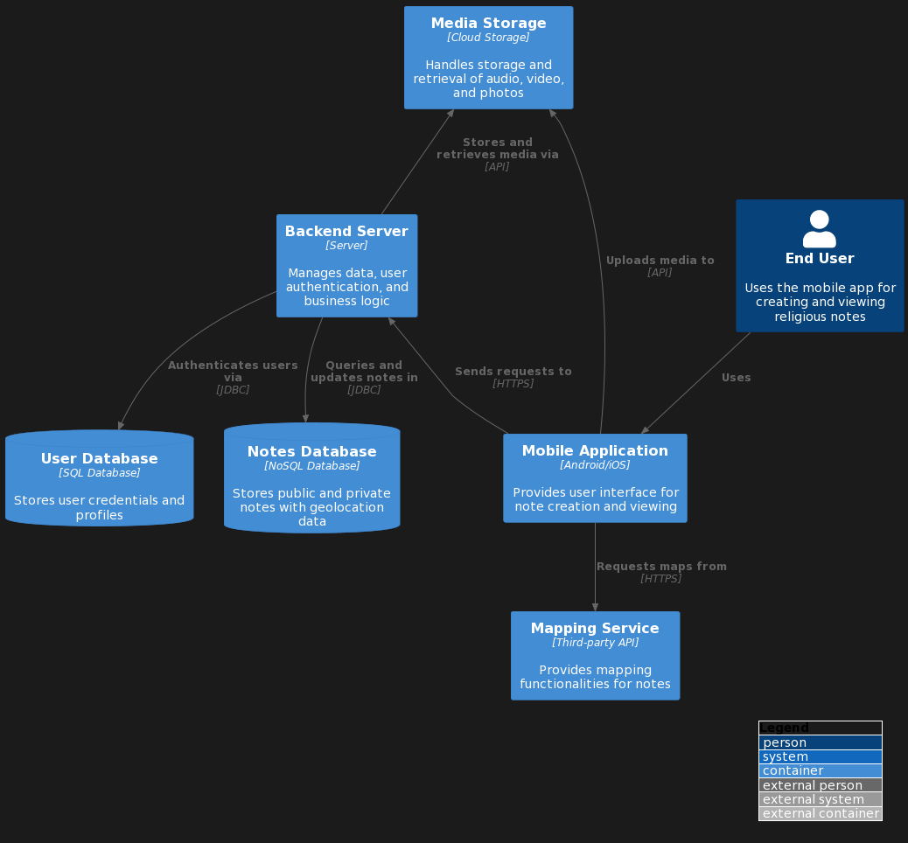

<!-- A header image is optional; if used should be no greater than 200x600 -->
<!-- -->

## Overview

 Where’s Religion is an open-source mobile and desktop application that supports in-person research, remote data entry, media sharing, and mapping. To do this, the mobile app enables users to collect fieldnotes, images, videos, and audio files - all geotagged and timestamped. The desktop companion app provides a more feature-rich format to refine fieldnotes, make new entries, or, for certain user profiles, review or grade other users’ entries.

### Information

- **Source Code:** <https://github.com/oss-slu/lrda_mobile>
- **Client** <!-- Name of the customer, possibly a link (check with them first). -->
- **Current Tech Lead:** [Yash Bhatia](https://yashb196.github.io/yashb196/, https://github.com/yashb196, https://www.linkedin.com/in/yashbhatia238/.)
- **Developers:**
  - [Andrew Chen](https://github.com/AndchooChen) (capstone)
  - [Tom Irvine](https://github.com/irvinet20) (capstone)
  - [Tianhao Wang](https://github.com/SamSam9812) (capstone)

  -[Stuart Ray](https://github.com/Stuartwastaken)(alumni)
  -[Izak Robles](https://github.com/izakrobles)(alumni)
- **Start Date:** 20 Feb 2023
- **Adoption Date:** 20 Feb 2023
- **Technologies Used:** 
  - Tech Stack: The core technologies include React Native for cross-platform mobile app development and TypeScript for adding static type definitions to JavaScript​​.
  - Key Languages: TypeScript is used along with JavaScript, which is compiled by the Expo server​​​​.
  - Key Frameworks: React Native is the primary framework for building the app's user interface, and Expo CLI is utilized for running the app during development​​.
  - Databases: While the specific database technologies are not mentioned in the quoted sections, the app connects to the Rerum Website for data integration, which may imply the use of web APIs to interact with backend data storage​​.
  - Critical Dependencies: Node.js is a runtime requirement for executing the JavaScript code, and the dependency management is handled by Yarn, as indicated by the use of yarn install and yarn run start commands for setting up the app​​​​​​.
- **Type:** {Mobile}
- **License:** [MIT](https://opensource.org/license/mit/)

## Users

- End user will log into the application 
- When logged in there will be an option to either view global notes(notes that other people published) or view an empty page with a + sign at the bottom to add a note 
- once clicked on + the user can then add a title (manditory) along with audio/video/photo/ tags(manditory) and text for the note 
- click on the top right icon to make it public
- if you still need it private go back.
- map icon will represent all the global notes and where it is generated.
, and link to the Where's Religion Documentation[detailed user-oriented documentation](https://github.com/oss-slu/lrda_mobile/blob/main/README.md).

## Technical Information

## Overview
Overview of the software architecture.

Where’s Religion is an open-source mobile and desktop application that supports in-person research, remote data entry, media sharing, and mapping. To do this, the mobile app enables users to collect fieldnotes, images, videos, and audio files - all geotagged and timestamped. The desktop companion app provides a more feature-rich format to refine fieldnotes, make new entries, or, for certain user profiles, review or grade other users’ entries. When published, all entries are automatically curated on a publicly available, interactive map with search and filter functions for research. We have conceptualized and designed for students, researchers, and public users to document and share their respective encounters with “religion” in everyday life – all with the intended purpose of democratizing data collection and visualizing religious diversity at scale.

## Development Priorities

- The app does not compile to the web due to a dependency on react-native-maps.
- In the location data section of a note, an error displaying "NaN" may appear.
- Scroller on add note and edit note sometimes do not work on IOS
- The notes orientation on map page for android is off centered.
- Styling of the screens using [tamagui](https://tamagui.dev/)

## Get Involved

Overview of contribution and participation information, [contributors guide](https://github.com/oss-slu/lrda_mobile/blob/main/README.md)
