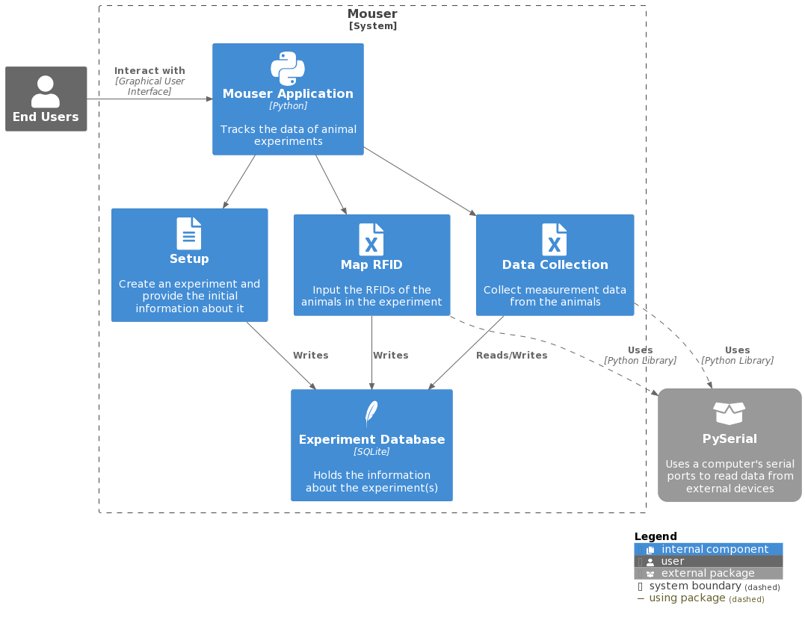

## Overview

 Created mainly for SLU researchers, this software is used for tracking the data of animal experiments. Running as a desktop app, users of the software can create and manage experiments in one easy place. Animals can be scanned into the system using RFID, where they can be quickly accessed for data collection and grouping. Over the course of an experiment, the user is able to take measurements of the animals using devices connected to the computer.

### Information

- **Source Code:** <https://github.com/oss-slu/Mouser>
- **Client:** Dr. Karoly Toth
- **Current Tech Lead:** [Logan Wyas](https://github.com/loganwyas)
- **Developers:**

  - [Uday Prasad Aitha](https://github.com/aithaprasad) (alumni)
  - [Tyler Bush](https://github.com/tbush03) (alumni)
  - [Cori Diaz](https://github.com/coridiaz) (alumni)
  - [Ryan Carmody](https://github.com/rc10283) (capstone)
  - [Andrew Obermiller](https://github.com/aobermiller) (capstone)
  - [Stanley Yang](https://github.com/stanleyyang2001) (capstone)

- **Start Date:** July 12, 2022
- **Adoption Date:** July 12, 2022
- **Technologies Used:**
  - Python
    - Tkinter
  - SQLite
- **Type:** Desktop
- **License:** [GNU General Public License v3.0](https://opensource.org/license/gpl-3-0/)

## Users

Upon running the software, you will first login using the account information you have been given. Then, to get to the main part of the application, click on the "Experiments" button. This will bring you to a page with have a list of experiments and the option to create a new experiment. If chosing to create a new experiment, you will enter in all of the experiment information that is necessary for the application. If you click on one of the experiments, it will bring you to the menu of that experiment. From there, you have the option to map animals with RFID, collect measurement data, and configure animal groups.

## Technical Information

### Overview

Overview of the software architecture.

### Development Priorities

- Connect the application to hardware devices
- Create a modern-looking user interface
- Add automated testing
- Implement account management
- Build an executable for the software
- Make warning/error screens to prevent internal issues

## Get Involved

If you would like to contribute to this project, please visit our [GitHub Page](https://github.com/oss-slu/Mouser) to create your own issues or pull requests.
