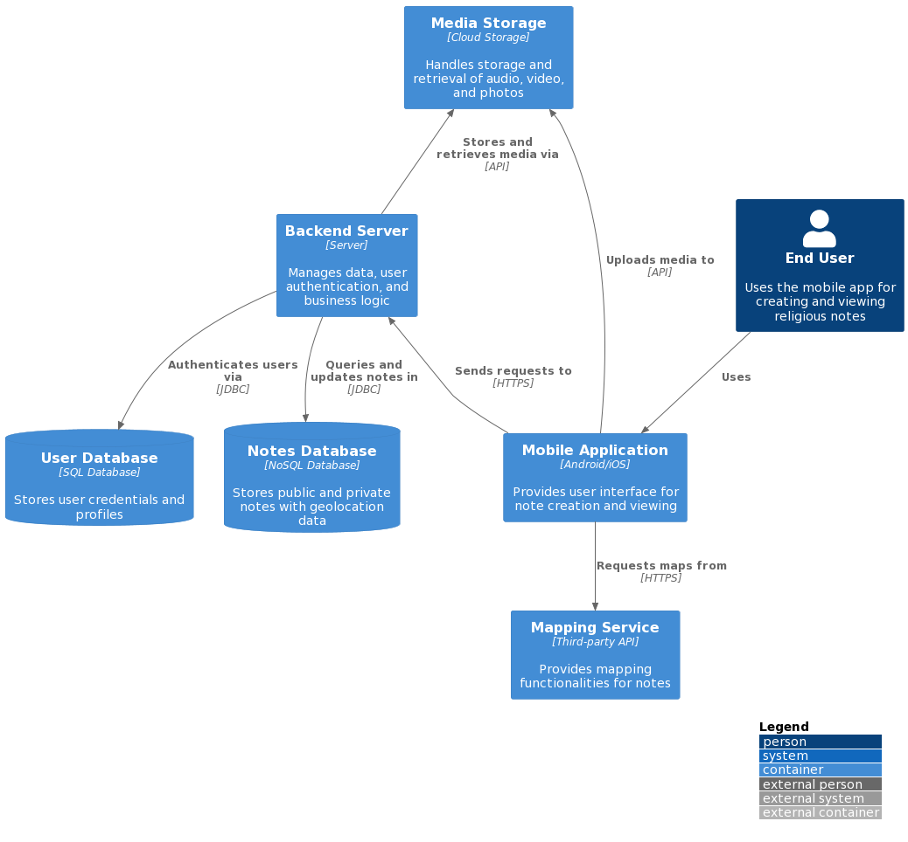

<!-- A header image is optional; if used should be no greater than 200x600 -->
<!-- -->

## Overview

 Where's Religion? is conceptualized and designed for diverse users with interests in sharing media and notes about their respective encounters with "religion" in everyday places. Nearly all digital humanities scholarship in religion, theology, and adjacent fields perpetuates historical biases of text-based knowledge and media. While texts are no doubt essential to these fields, the premise of Where’s Religion? has been to create tools for acknowledging, analyzing, and interpreting religion as a multisensory and multimodal component of human life, both within faith traditions and beyond them in the fabrics of culture and society. We believe that it is time for our research methodologies to catch up with the realities of human experience and that creating a platform for collecting, organizing, and sharing images, videos, and sounds, along with textual notations, sourced from a wide range of users, is a necessary place to start. We also believe that the resulting collection of materials will be of immense value to American public life.

### Information

- **Source Code:** <https://github.com/oss-slu/lrda_mobile>
- **Client** Dr.Adam Park
- **Current Tech Lead:** [Yash Bhatia]([portfolio](https://yashb196.github.io/yashb196/), [github](https://github.com/yashb196), [linkedin](https://www.linkedin.com/in/yashbhatia238/).)
- **Developers:**
  - [Andrew Chen](https://github.com/AndchooChen) (capstone)
  - [Tom Irvine](https://github.com/irvinet20) (capstone)
  - [Tianhao Wang](https://github.com/SamSam9812) (capstone)

  -[Stuart Ray](https://github.com/Stuartwastaken)(alumni)
  -[Izak Robles](https://github.com/izakrobles)(alumni)
- **Start Date:** 20 Feb 2023
- **Adoption Date:** 20 Feb 2023
- **Technologies Used:** 
  - Tech Stack: React Native, TypeScript, JavaScript​​.
  - Key Languages: TypeScript, JavaScript, Expo​​​​.
  - Key Frameworks: React Native, Expo CLI ​​.
  - Databases: Rerum.
  - Critical Dependencies: Node.js, JavaScript, Yarn.
- **Type:** Mobile
- **License:** [MIT](https://opensource.org/license/mit/)

## User Guide

- End user will log into the application 
- When logged in there will be an option to either view global notes(notes that other people published) or view an empty page with a + sign at the bottom to add a note 
- once clicked on + the user can then add a title (manditory) along with audio/video/photo/ tags(manditory) and text for the note 
- click on the top right icon to make it public
- if you still need it private go back.
- map icon will represent all the global notes and where it is generated.
, and link to the Where's Religion Documentation[detailed user-oriented documentation](https://github.com/oss-slu/lrda_mobile/blob/main/README.md).

## Technical Information

## Overview
Overview of the software architecture.

Where’s Religion is an open-source mobile and desktop application that supports in-person research, remote data entry, media sharing, and mapping. To do this, the mobile app enables users to collect fieldnotes, images, videos, and audio files - all geotagged and timestamped. The desktop companion app provides a more feature-rich format to refine fieldnotes, make new entries, or, for certain user profiles, review or grade other users’ entries. When published, all entries are automatically curated on a publicly available, interactive map with search and filter functions for research. We have conceptualized and designed for students, researchers, and public users to document and share their respective encounters with “religion” in everyday life – all with the intended purpose of democratizing data collection and visualizing religious diversity at scale.

## Development Priorities

- The app does not compile to the web due to a dependency on react-native-maps.
- In the location data section of a note, an error displaying "NaN" may appear.
- Scroller on add note and edit note sometimes do not work on IOS
- The notes orientation on map page for android is off centered.
- Styling of the screens using [tamagui](https://tamagui.dev/)

## Get Involved

Overview of contribution and participation information, [contributors guide](https://github.com/oss-slu/lrda_mobile/blob/main/README.md)
