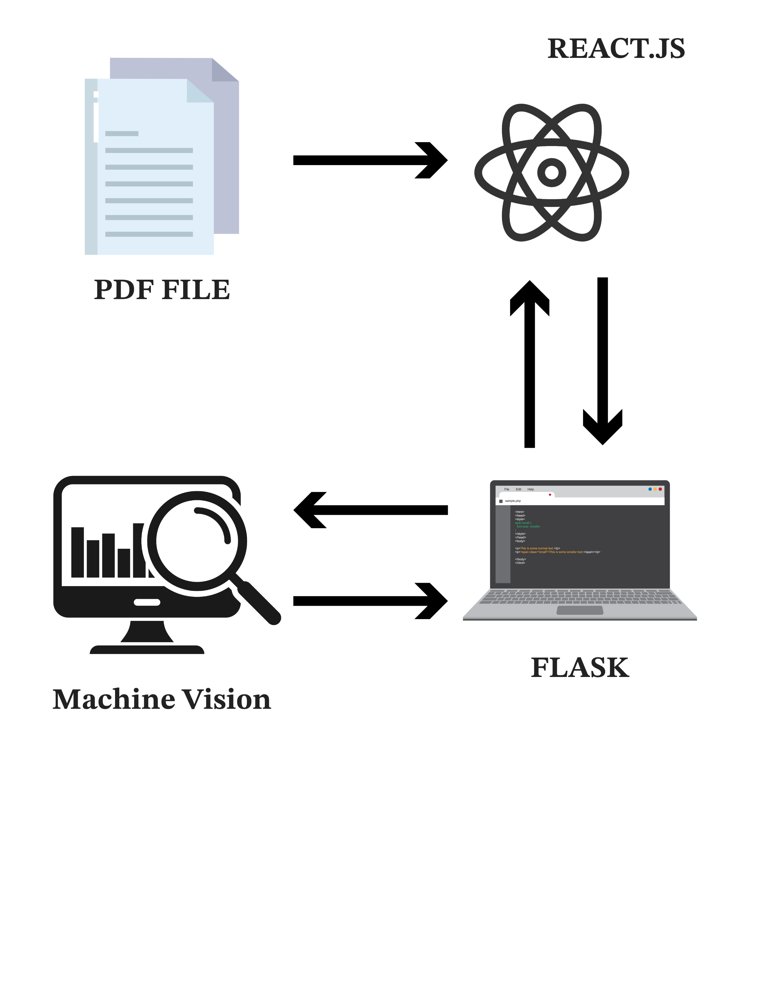

<!-- A header image is optional; if used should be no greater than 200x600 -->
<!-- -->

## Overview

The chemistry department at SLU uses paper scantron (fill-in-the-bubble) sheets for exams. To grade the exams, they physically take the papers to one of the two machines on campus capable of processing this data. This process is time consuming and a bit risky - the machines are getting old and might break. In general, they like using paper based fill-in-the-bubble exams, but are interested in digitizing the grading process through software that presents them with detailed results, similar to the results they get from the physical scantron machines. The specific sheets used by the chemistry department are Scantron form number 95945. While not hugely expensive, not having to order such sheets is a cost-saving. Most importantly, this software would replace the technology that's becoming obsolete and simplify the grading process.

### Information

- **Source Code:** [https://github.com/oss-slu/bubble_scan](https://github.com/oss-slu/bubble_scan) 

- **Client** Dr. Brian Woods
- **Current Tech Lead:** Raju Karmuri  
- **Developers:**

  - Myles Correa 

  - Ahmet Ali Yildiz 

  - Nischita Nannapaneni 

- **Start Date:** Jan, 2024
- **Adoption Date:** Aug, 2022
- **Technologies Used:**
  - React
  - Flask
  - OpenCV
- **Type:** Web application
- **License:** [MIT](https://opensource.org/license/mit)

### User Guide

The bubble scan is a web application where the user provides digital copies of standard paper scantron sheets in a PDF format and the software produces tabular results in a CSV file. The PDF file is seggregated into individual input files and the software uniquely identifies the student id and student's answer to each question using an AI component handled by the AI capstone team. The AI component scans the sheets and returns the results(i.e., Student ID and students' answers) in a JSON format. The backend component converts the JSON to CSV format and returns the output to the frontend component. The user can then download the CSV file that has both the results from the frontend component.

## Technical Information

### Technical Overview

Overview of the software architecture.

### Development Priorities

- Develop a robust frontend component that allows user to upload the Scantron sheets
- Develop the backend component to receive the sheets from the frontend component
- The backend component should work efficiently and send the sheets to the AI component
- The backend component should receive the results from the AI component
- The backend component should convert the results to CSV format as expected from client and send it to frontend
- The frontend component allows user to download the results

## Get Involved

If you would like to contribute to this project, please visit our [GitHub page](https://github.com/oss-slu/bubble_scan) to create your own issues or pull requests.
