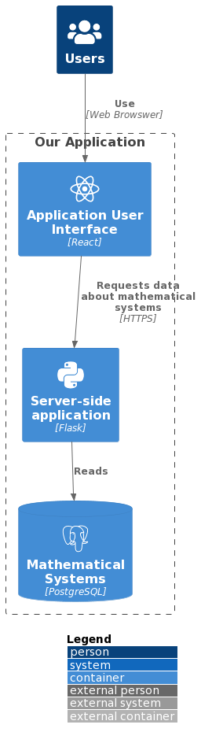

<!-- A header image is optional; if used should be no greater than 200x600 -->
<!-- -->

## Overview

The goal of this project is to create a flexible, web-based, search-driven user interface for a database of arithmetic dynamical systems. The web-based interface to access the data will be search-driven making tasks such as locating examples with specific properties or examining the collective statistics of certain sets of dynamical systems as simple as possible. This data will be able to be exported for further analysis. This type of searchable rich data set will save researchers countless hours of computation as well as provide a means to identify previously unknown patterns and connections. The application allows users to find and filter dynamical systems, with different statistics of the filtered results calculated.

### Information

- **Source Code:** <https://github.com/oss-slu/dads>
- **Client** Dr Benjamin Hutz
- **Current Tech Lead:** Abhilash Kotha [GitHub](https://github.com/AbhilashKotha)  [LinkedIn](https://www.linkedin.com/in/abhilashkotha/)
- **Developers:**
  - [Evan Richmond](https://github.com/Evan-Richmond) (capstone)
  - [Andrew Jelliss](https://github.com/AJelliss) (capstone)
  - [Louis Rolwes](https://github.com/lRolwes) (capstone)
  - [Greih Murray](https://github.com/GreihMurray) (alumni)
  - [Josiah Glyshaw](https://github.com/jglyshaw) (alumni)
  - [Thomas McGuigan](https://github.com/thomasmcg77) (alumni)

- **Start Date:** Mar, 2023 
- **Adoption Date:** Mar, 2023
- **Technologies Used:** 
  - React
  - Flask
  - PstgreSQL
- **Type:** Web application
- **License:** [MIT](https://opensource.org/license/mit)

## Users

Upon launching the web application the users are taken to the Home page of the application where they see information about the application. User needs to click on "Dynamical Systems" page which loads all the systems in the page in a table. User can apply filters based on dimension, degree, class and other attributes. User can also click on a row and can get more information about the selected row. On the right side, user can see a few statistics of the filtered results. 

## Technical Information

## Overview

Overview of the software architecture.

## Development Priorities

- Complete implememting all the existing flters and statistics
- Interact with a larger set of data
- Improve the Queries and execution time
- Improve the UI and UX of the application
- Create documentation for the users of the application
- Implement the details page of the function with real data (currently static)

## Get Involved

If you would like to contribute to this project, please visit our [GitHub page](https://github.com/oss-slu/dads) to create your own issues or pull requests.