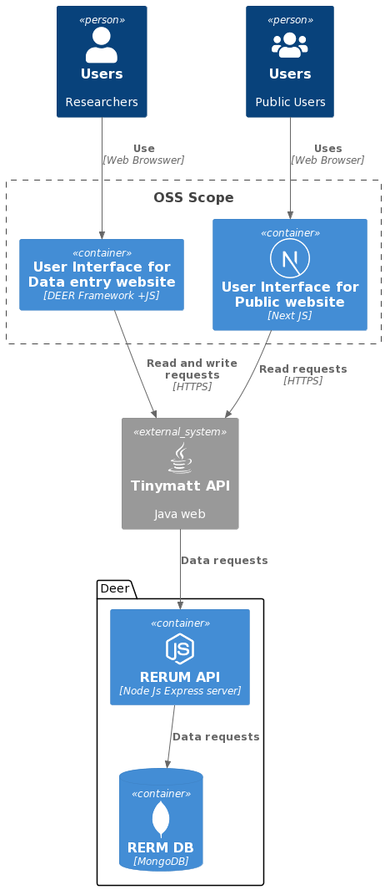

<!-- A header image is optional; if used should be no greater than 200x600 -->
<!-- -->

## Overview

The Gallery of Glosses is a combination of interfaces that allow non-technical users to perform research and classify Glosses (on-page commentary) from the Gospel of Matthew and other source manuscripts. There is a NextJS interface for the [public-facing website](https://gog-public-site.vercel.app/) bootstrapped with style. This interface can be used by anyone to view information regarding glosses and manuscripts. There is another interface built which is used by researchers and administration for adding and editing gloss and manuscript information. The data for these interfaces is stored in [RERUM](https://rerum.io).

### Information

- **Source Code:**
  - [Data entry website](https://github.com/CenterForDigitalHumanities/glossing-entries)
  - [Public Website](https://github.com/CenterForDigitalHumanities/Gallery-of-Glosses)
- **Client** Dr Atria Larson
- **Current Tech Leads:** 
  - Bryan Haberberger (SLU Research Computing Group staff)      
  - Patrick Cuba (SLU Research Computing Group staff)      
  - Abhilash Kotha (Capstone)     
- **Developers:**
  - Tu Tran (capstone) 
  - Kameron Bustos (capstone) 
  - Josh Cohen (capstone) 

- **Start Date:** Aug, 2020 
- **Adoption Date:** Jul, 2023
- **Technologies Used:** 
  - HTML5 - CSS - Javascript
  - DEER Framework
  - Next JS
- **Type:** Web Applications
- **License:** NA

### User Guide

**Public Website:** Users can visit the public website using this [link](https://gog-public-site.vercel.app/).  They can read more about the application and glossing terminology as well as browse through the public glosses.  
**Data entry Website** Researchers and contributors can access the data entry application [here](https://glossing.rerum.io/).  Note you must be a registered user and must sign in, as this data entry portal is not public.  Verified users can 
- view, add, and edit glosses
- attach and edit witnesses 
- manage gloss public visibility for the public website

## Technical Information

### Technical Overview

Overview of the software architecture.

### Development Priorities

- Feature to add a reference to any witness added
- Add clear instructions for users on all the user forms
- A new interface for summarizing the metadata for manuscripts
- Read and display metadata fields from TPEN project

## Get Involved

If you would like to contribute to this project, please visit our GitHub pages for the [data entry website](https://github.com/CenterForDigitalHumanities/glossing-entries) and the [public website](https://github.com/CenterForDigitalHumanities/Gallery-of-Glosses) to create your own issues or pull requests.