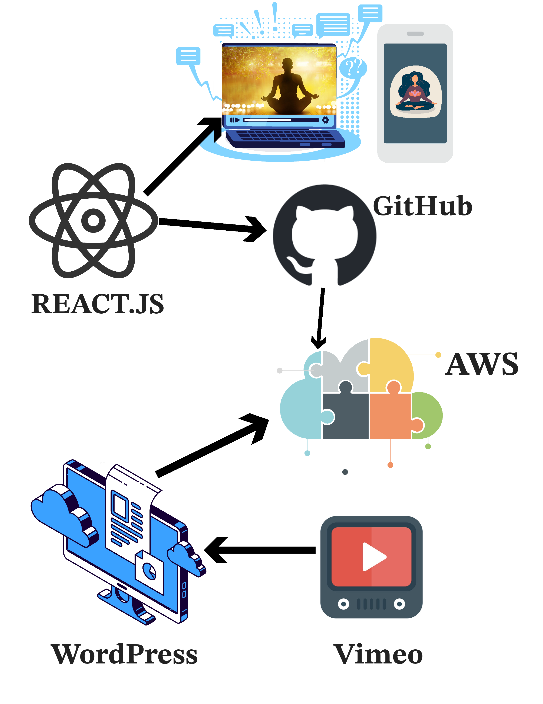

<!-- A header image is optional; if used should be no greater than 200x600 -->
<!-- -->

## Overview

Our goal is to help children and families grow stronger together. We help children and their parents breathe for calm and find their safe place for love and healing with guided meditations and powerful mind-body tools. The app is also geared to professionals and therapists who work with children. Let's make CALM our SUPERPOWER! 

### Information

- **Source Code:** [https://github.com/ytadvisors/inner-peace-time-private](https://github.com/ytadvisors/inner-peace-time-private) 
and
[https://github.com/ytadvisors/inner-peace-time-wp](https://github.com/ytadvisors/inner-peace-time-wp)

- **Client** Dr. Vicki Atlas Israel
- **Current Tech Lead:** Raju Karmuri   
- **Developers:**
  - Yomi Toba (ytadvisors)  
  - Raju Karmuri (SLU)  

- **Start Date:** Apr, 2023 
- **Adoption Date:** Apr, 2023
- **Technologies Used:** 
  - React
  - WordPress
  - AWS
  - Vimeo
- **Type:** Web application
- **License:** [MIT](https://opensource.org/license/mit)

### User Guide
The inner peace time meditation app can be downloaded from the website  https://slu.innerpeacetime.com/ Each user has their own login ID and password to access the website. Documentation on how to access the app will be provided. The app has several videos and audio files that have guided meditation. Users can open the files and follow the guided meditation. Our job at Open Source is to maintain the app, test cases if needed and assist the client with their need. Sometimes it can be developing new app features, creating new webpages for exporting data, etc. We do not have complete access to all the tools used for this app. The React and WordPress backend source code is available on GitHub. All video and audio files are stored in Vimeo and can be accessed from WordPress.

## Technical Information

### Technical Overview

Overview of the software architecture.

### Development Priorities

- Maintain the app by writing test cases if needed
- Assist the client with exporting the data from WordPress
- Add new features to the app as requested by the client
- Develop new websites for processing data from WordPress
- Create documentation for the users of the application
- Adding new video and audio files to the WordPress if needed

## Get Involved

If you would like to contribute to this project, please visit our GitHub pages [React](https://github.com/ytadvisors/inner-peace-time-private) and [WordPress](https://github.com/ytadvisors/inner-peace-time-wp) to create your own issues or pull requests. This is a private project, please get the access from the admin of the GitHub repository.