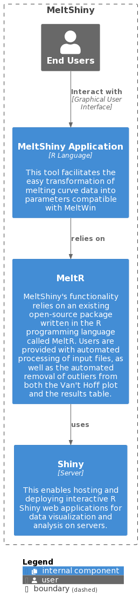

## Overview

MeltShiny is a software application that automates the analysis and visualization of DNA melting curves for researchers in chemistry, biology, and genetics. It is built on tools like MeltWin and MeltR, resulting an intuitive graphical user interface with robust data processing capabilities powered by R. MeltShiny removes the need for manual curve fitting  with just a few clicks, researchers can upload their DNA melting data and automatically generate graphs and tables. Key benefits include automated outlier removal, compatibility with modern operating systems, and accessibility for non-programmers. By streamlining tedious tasks like handling file formats and filtering data, MeltShiny allows researchers to focus their time on scientific analysis and interpretation. Its simple yet powerful interface makes complex computational analysis of DNA thermodynamics accessible to scientists with varied technical skill levels.

### Information

- **Source Code:** [https://github.com/oss-slu/MeltWin2.0](https://github.com/oss-slu/MeltWin2.0) 
- **Clients:**
  - [Dr. Brent Znosko](https://www.slu.edu/science-and-engineering/academics/chemistry/faculty/brent-znosko.php)
  - Sebastian Arteaga (Assistant)
- **Current Tech Lead:** Pranitha Bollepalli 
- **Developers:**
  - Andrew Vazzano (capstone) 
  - Samuel Mercier (capstone) 
  - Swetha Repalli (capstone) 
  - Zohaib Ahmed (alumni) 
  - Ethan Gray (alumni) 
  - Massimo Evelti (alumni) 
  - Uday Prasad Aitha (alumni, prior tech lead)  
  - Sailikhita Pulijala (alumni, prior tech lead)  
  - Shlok Patel (alumni)  
  - Colleen Wade (alumni)  
  - Anthony Hampton (alumni)  

- **Start Date:** July 2022
- **Adoption Date:** July 2022
- **Technologies Used:**
  - R
  - Shiny Package
- **Type:** Web Application
- **License:** [GNU General Public License v3.0](https://opensource.org/license/gpl-3-0/)

### User Guide

MeltShiny is a web-based tool designed for researchers to easily analyze and visualize DNA melting curves.

**Access the Web App**: Open the MeltShiny web app on any modern browser.

**Upload Your Data**: Use the "Upload Data" section to upload files in .csv format.

**Visualize Results**: Customize and generate graphs in the "Visualize Data" section to explore melting curves and other data.

**Analyze and Export**: View detailed thermodynamic parameters in the "Analysis" section and export findings in preferred formats.

**Get Help**: Visit the "Help" section for guides and support, or contact our team directly for assistance.

MeltShiny streamlines complex DNA data analysis, allowing researchers to focus on scientific insights.

## Installation

MeltShiny requires specific dependencies to function correctly. Installation files for R packages are included in the application bundle:
  - **MacOS**: MeltShinyDependenciesInstaller.command (located in the MacOS_Scripts folder)
  - **Windows**: MeltShinyDependenciesInstaller.bat (located in the Windows_Scripts folder)

**Important Notes:**

  - **Windows Users**: Ensure that the R bin folder is added to your PATH variable for proper execution.
  - **MacOS Users**: The script can be run directly without additional configuration.

## Technical Information

### Technical Overview

### Development Priorities

- **Latest R version required** : Ensure compatibility with the most recent version of R.
- **Knowledge on Shiny server** : Expertise in Shiny server setup and management.
- **Implement user-friendly UI** : Develop a clean, intuitive interface for ease of use.
- **Require automated testing** :  Implement comprehensive testing to ensure reliability.
- **Version Control and Collaboration** : Utilize version control systems and collaboration tools for effective project management.

### Additional Details:
- **Project Goals**: Improve user experience by continuously incorporating feedback from researchers and addressing emerging needs in DNA melting curve analysis.
- **Future Enhancements**: Explore integration with additional data formats, enhance error-handling capabilities, and expand visualization options.
- **Community Engagement**: Actively seek contributions from the open-source community to foster collaboration and innovation.

## Get Involved

If you would like to contribute to this project, please visit our [GitHub page](https://github.com/oss-slu/MeltWin2.0) to create your own issues or pull requests.
