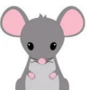
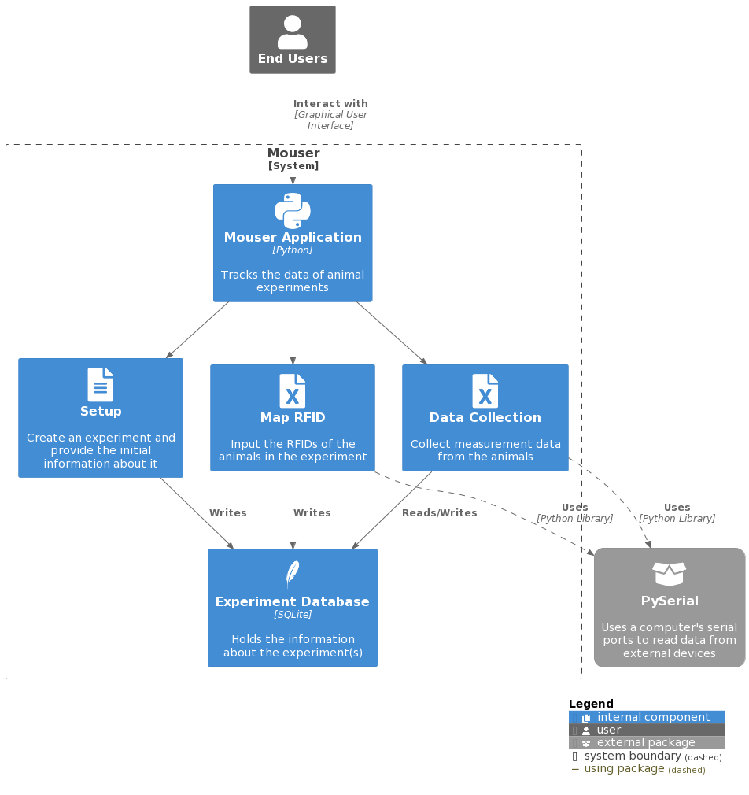

## Overview

Created mainly for SLU researchers, this software is used for collecting and analyzing data from animal experiments. While in the lab, scientists are often required to keep their environments very clean, which means that they must limit how much they touch the computers and lab equipment. To facilitate this, Mouser allows laboratory equipment (balances, calipers, RFID chip readers) to be connected to a PC, and researchers can quickly take repeated measurements with as little interaction as possible. Running as a desktop app, users of the software can create and manage experiments in one easy place. Animals implanted with RFID biochips can be scanned into the system for easy identification and data access. Once a session is started, the user is able to take measurements of the animals using devices connected to the computer without having to use the keyboard or the mouse. The program gives confirmation to the user through sounds and changes in display, allowing them to focus on the experiment.

### Information

- **Source Code:** [https://github.com/oss-slu/Mouser](https://github.com/oss-slu/Mouser) 
- **Client:** Dr. Karoly Toth
- **Current Tech Lead:** Jack Belyeu 
- **Developers:**

  - Ryan Carmody (capstone) 
  - Andrew Obermiller (capstone) 
  - Stanley Yang (capstone) 
  - Uday Prasad Aitha (alumni, previous tech lead) 
  - Tyler Bush (alumni) 
  - Cori Diaz (alumni) 
  - Logan Wyas (previous tech lead) 

- **Start Date:** July 2022
- **Adoption Date:** July 2022
- **Technologies Used:**
  - Python
    - Tkinter
    - PySerial
  - SQLite
  - GitHub Actions
- **Type:** Desktop
- **License:** [GNU General Public License v3.0](https://opensource.org/license/gpl-3-0/)

### User Guide

Upon running the software, it will open to the Mouser home page. From there, you can click 'Settings' in the top navbar to edit serial port settings; or 'File' to access the program's core functionalities. 'New Experiment' handles the creation of initial experiment parameters and creates a corresponding .mouser file. 'Open Experiment' opens .mouser files and allows the user to collect data for the opened experiment, use RFID to map and scan animals for easy data collection, and analyze or export the experiment data. The program currently supports simulated RFID so that a user can model realistic workflows without the need for real hardware or animals.

## Technical Information

### Technical Overview

Overview of the software architecture.

### Development Priorities

- Ensure the application connects and works with common lab hardware
- Modernize and improve the user interface without sacrificing 0-click data collection
- Build a working executable that runs on the client's machines
- Improve auditory feedback, especially for errors and warnings
- Expand data export functionality to work with other statistics and data analysis tools

## Get Involved

If you would like to contribute to this project, please visit our [GitHub page](https://github.com/oss-slu/Mouser) to create your own issues or pull requests.
