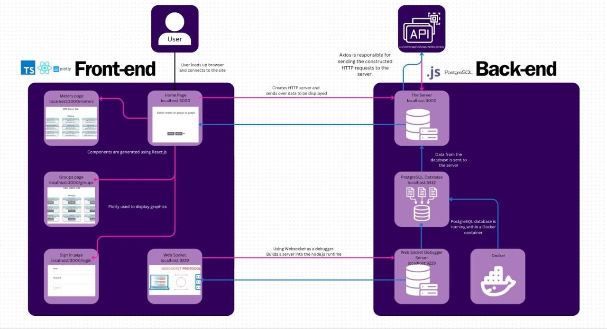

 

## Overview

The Open Energy Dashboard (OED) is a crucial open-source project that facilitates the visualization of energy information through a web-based application. Its significance lies in promoting collaboration and knowledge-sharing to advance common sustainability goals. Unlike other proprietary dashboards, OED is free, portable, and driven by user needs, embodying principles such as perpetual freedom, shared advancements, and user-centric design. The typical user, ranging from energy managers to sustainability professionals, benefits from its user-friendly interface and diverse functionalities, allowing easy management of energy data without the need for external support.

### Information

- **Source Code:** [https://github.com/oss-slu/OED](https://github.com/oss-slu/OED) 
- **Client:** Steve Huss-Lederman
- **Current Tech Lead:** Rakesh Ranga Buram 
- **Developers:**

  - Nischita Nannapaneni (capstone) 
  - Joijanae  Laws (capstone) 
  - Mark Mehta (capstone) 

- **Start Date:** September 2023
- **Adoption Date:** September 2023
- **Technologies Used:**
  - PostgreSQL
  - React
  - Redux
  - Node.js
  - Javascript
    - Plotly.js
  - Typescript
  - Javascript Promises
  - Chai
  - Mocha
- **Type:** Desktop
- **License:** [MPL version 3.0](https://github.com/oss-slu/OED/blob/development/LICENSE.txt)

### User Guide

- **Developers:**
    The [developer website](https://openenergydashboard.org/developer/developer/) is available to learn about working with the OED project.

- **Production/Sites:**
    The [admin installation page](https://openenergydashboard.org/helpV0_7_0/adminInstallation/) is available to learn about installing OED for a production environment (normal OED site). These are part of the overall admin help pages for OED.

## Technical Information

### Technical Overview

Overview of the software architecture.

### Development Priorities

- Ensuring that the dashboard remains easy to use, especially for non-technical users
- Fixing issues related to incorrect or inconsistent data display
- Improving the speed and responsiveness of the dashboard, particularly when handling large datasets
- Addressing and resolving any bugs or glitches reported by users or contributors

## Get Involved

If you would like to contribute to this project, please visit our [GitHub page](https://github.com/oss-slu/OED) to create your own issues or pull requests.

