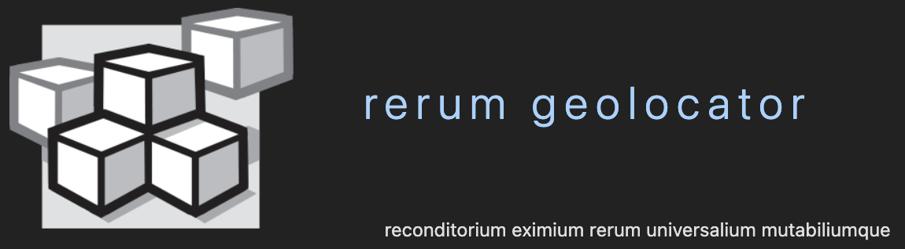
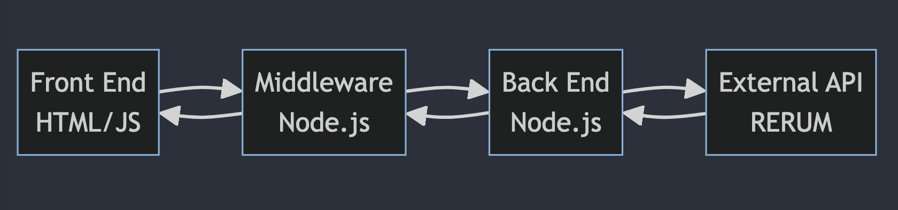

## Overview
The application enables users to enhance discovery and access to digital resources through geographic visualization and annotation. Users can bring in their own resources and generate Geolocating Web Annotations for them. These structured annotations contain geographic coordinates and other spatial/temporal metadata using the Web Annotation data model. This enables accurate placement of the resources onto a web map.
The application also supports adding a `navPlace` property to IIIF Defined Types. The International Image Interoperability Framework (IIIF) provides a standard way of describing and delivering digital resources. The IIIF Defined Types with the `navPlace` property can be imported into the RERUM platform, this provides a map-based visualization that enables exploring, discovering and connecting resources through their geographic metadata. The Navplace Viewer allows new insights and connections by leveraging the spatial relationships between resources.

### Information

- **Source Code:**  https://github.com/CenterForDigitalHumanities/geolocator  , https://github.com/CenterForDigitalHumanities/navplace-viewer 
- **Client** Bryan Haberberger , Patrick Cuba 
- **Current Tech Lead:** Yashaswini Shivalingaiah   
- **Developers:**
    - Tony Obradovic 
    - Emily Henken 
    - Kyla McMakin 
- **Start Date:** 30 May 2020
- **Adoption Date:** 25 Aug 2023
- **Technologies Used:**
    - Tech Stack: Web Map Visualization
    - Key Languages: JavaScript, HTML, CSS
- **Type:** Desktop
- **License:** Primary Developers: Bryan Haberberger and Patrick Cuba © 2023 Research Computing Group at Saint Louis University

## User Guide
### Rerum Geolocator
The Geolocator provides an user interface to - 
- Add a digital resource by entering the URI
- Search for a location or move the map marker to pinpoint the geographic coordinates.
- Generate a structured annotation in the Web Annotation data model with geographic metadata.
- The annotation can be exported as JSON-LD and imported into the RERUM platform for enhanced discovery and visualization.
### Navplace Viewer
The Navplace Viewer allows you to:
- Visualize IIIF resources on a web map using their navPlace geographic metadata.
- Input the exported JSON data.
- Access resource details from map icons and zoom to locations.

## Overview
Overview of the software architecture.

The geolocator application utilizes a layered architecture consisting of a front end user interface written in HTML and JavaScript, middleware in Node.js, a back end server in Node.js, and an external API system provided by RERUM. The front end allows user interaction and displays the interface. It passes user input to the middleware layer which processes requests and routing between the front and back end. The back end server receives requests from the middleware, makes calls to the RERUM API to execute data operations based on the request, gets the response from RERUM indicating the result, processes the response, and passes it back to the middleware. The middleware then forwards the response to the front end user interface layer to display the results to the user. This layered architecture with the front end, middleware, server, and external API allows the full user interaction flow and application capabilities. The use of common web technologies like HTML/JS, Node.js provides a scalable and extensible implementation.

## Development Priorities
- To confirm their data is displayed correctly, users should preview it within the web map interface itself, with an "Edit Mode" that allows them to manipulate the data visually until it appears as desired.
- CI/CD Workflows
- Support creating Features with common metadata properties
- Contriobutors Guide
- IIIF Validations to verify on the URIs provided by users

## Get Involved

Overview of contribution and participation information, [contributors guide - Rerum Geolocator](https://github.com/CenterForDigitalHumanities/geolocator#readme) , [contributors guide - Navplace Viewer](https://github.com/CenterForDigitalHumanities/navplace-viewer#readme)
 

 