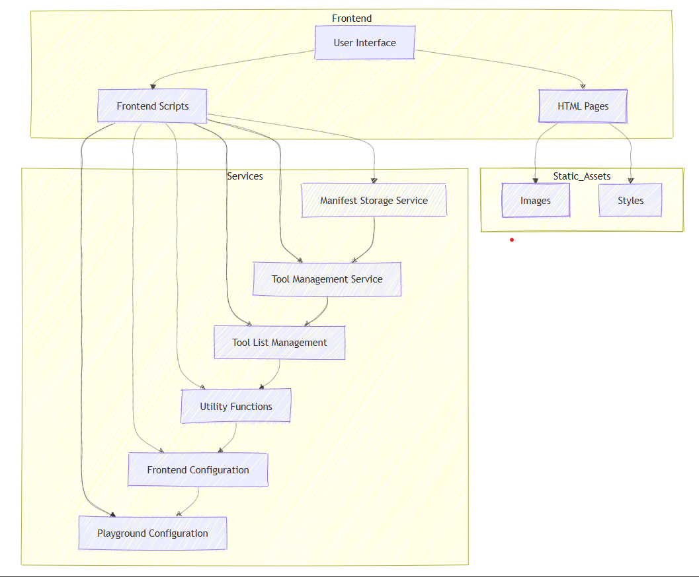

## Overview

This is a web space that uses the RERUM installation at the Walter J. Ong, S.J. Center for Digital Humanities to explore the possibilities of interoperable tools and standards. By using the Tiny Things sandbox, users can immediately create reusable JSON-LD objects that conform to IIIF and Web Annotation standards and find new ways to interact with them. It can use devstore (sandbox) Tinydev as a proxy server. The tools are helpful with transcription, annotation, Geolocator ( Providing a URI and picking point coordinates for that) etc.

### Information

- **Source Code:**  
    - https://github.com/CenterForDigitalHumanities/rerum-playground 
    
- **Client** 
    - Patrick Cuba 

- **Current Tech Lead:** Santosh Iragavarapu   

- **Developers:**
    - Bryan Haberberger 
    - Patrick Cuba 
    - Haneen AlSewari 
    - Hayden Karl 
    - Samuel Sheppard 

- **Start Date:**  June 2020
- **Adoption Date:**  Aug 2024
- **Technologies Used:**
    - Tech Stack: Web development (RERUM APIs)
    - Key Languages: JavaScript, HTML, CSS, Backend services (TBD)
- **Type:** Web application
- **License:** Primary Developers: Bryan Haberberger and Patrick Cuba © 2023 Research Computing Group at Saint Louis University

### User Guide

#### Rerum Playground

A web based application with a set of tools (existing) integrated in a playground to interact with objects that may exist in RERUM and all over the internet. After user logs in, The tools are helpful with transcription, annotation, Geolocator ( Providing a URI and picking point coordinates for that) etc.. This playground encourages users to freely experiment with these tools and it builds their confidence around them. They don't have to worry about their work saving in linked open land unless they want it to be saved. 

## Technical Information 

### Technical Overview

Overview of the software architecture.

The playground utilizes a layered architecture consisting of a front end user interface written in HTML and JavaScript, middleware in Node.js (or other), a back end server, and an external API system provided by RERUM. The front end allows user interaction and displays the interface. It passes user input to the middleware layer which processes requests and routing between the front and back end. The back end server receives requests from the middleware, makes calls to the RERUM API to execute data operations based on the request, gets the response from RERUM indicating the result, processes the response, and passes it back to the middleware. The middleware then forwards the response to the front end user interface layer to display the results to the user. This layered architecture with the front end, middleware, server, and external API allows the full user interaction flow and application capabilities. 

### Development Priorities

- A need for authentication 
- A sharable playground. Every tool should have a link to share their work build with that. 
- An option to save the users work (If they really want to keep it) built with a tool.
- Rerum tools page. (That lists and explains all the tools)
- CI/CD Workflows

## Get Involved

If you would like to contribute to this project, please visit our [GitHub page](https://github.com/oss-slu/rerum-playground) to create your own issues or pull requests.
