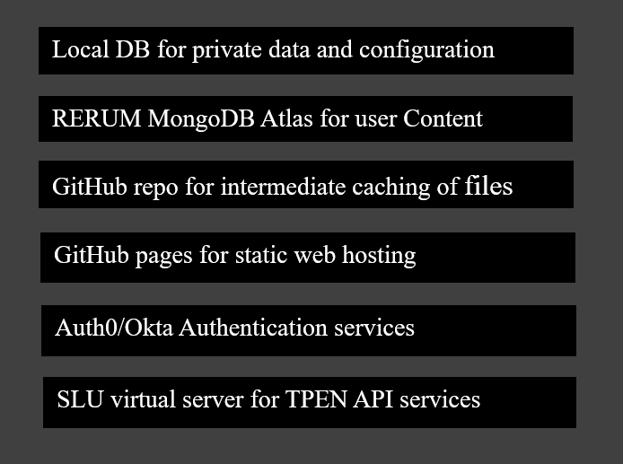

<!-- A header image is optional; if used should be no greater than 200x600 -->
<!-- -->

## Overview

These vanilla default and internally useful interfaces for the TPEN ecosystem that exemplify how you might build your own interfaces for specific projects. The directories each contain a named interface that serves as an example for how an external developer might use the TPEN Services API to implement a custom interface that leverages the TPEN platform. Interfaces are typically a web application, a simple HTML document, that utilizes Web Components that might be reused by others.

### Information

- **Source Code:** [https://github.com/oss-slu/TPEN-interfaces](https://github.com/oss-slu/TPEN-interfaces) 
- **Client** Dr Artia Larson 
- **Current Tech Lead:** Sowmya Mutya   
- **Developers:**
  - Patrick Cuba (SLU Research Computing Group)  
  - Bryan Haberberger (SLU Research Computing Group)  
  - Victor Onoja (Web Developer)  
  - Camille Daugherty 
  - Matthew Clendenning 
  - Sarah Fida Hussain 
- **Start Date:** Jan, 2023 
- **Adoption Date:** Aug, 2024
- **Technologies Used:** 
  - Tech Stack- Web pages accessing TPEN API services
  - Key Languages- HTML, CSS, JavaScript 

- **Type:** Web application
- **License:** Primary Developers: Bryan Haberberger and Patrick Cuba © 2023 Research Computing Group at Saint Louis University

### User Guide

 - **Public website** - Users can access the TPEN public website using the [link](https://t-pen.org/TPEN/). This version of TPEN (2.8) allows users to attach transcription data (either new or uploaded) to the actual lines of the original manuscript in a simple and flexible interface.
 - **TPEN3 Interfaces** -
   The directories here each contain an example of an interface that uses the TPEN authentication and interactions with the TPEN platform. For instance, the default location for transcription is TPEN Transcription Interface, which returns the file in /transcribe/index.html. If a project involves specialized transcription, such as music, the configuration can direct users to a custom location, like https://example.com/musicproject/interfaces/transcribe.html, with the project ID included in the query string. Examples of best practices include:

    - `index.html`: The default interface to launch,
    - Supporting files: `*.js`, `*.css`, `*.html`, etc.,
    - Configuration files: `manifest.yml` or `manifest.json` 

## Technical Information

### Technical Overview

The TPEN Interfaces project follows a layered architecture, consisting of front-end user interfaces built using HTML, CSS, and JavaScript that communicate with the TPEN Services API. This architecture allows developers to create custom interfaces by leveraging existing TPEN components and services. Below is a high-level overview of the architecture:

### Development Priorities

- **Development priorities for TPEN interfaces:**
    - Developing interface examples for external developers to use as templates.
    - Customizable interfaces include:
        - Classroom group management
        - Musical transcription
        - Project toolsets
        - Alternative languages and alphabets
    - **Current Priority:** The Classroom Group Interface, which is a suite of interfaces for creating and managing TPEN groups. This interface focuses on setting permissions for roles. Permissions determine access to various resources and dictate what visualizations might be needed within the interface.

## Get Involved

If you would like to contribute to this project, please visit our [GitHub page](https://github.com/oss-slu/TPEN-interfaces) to create your own issues or pull requests.