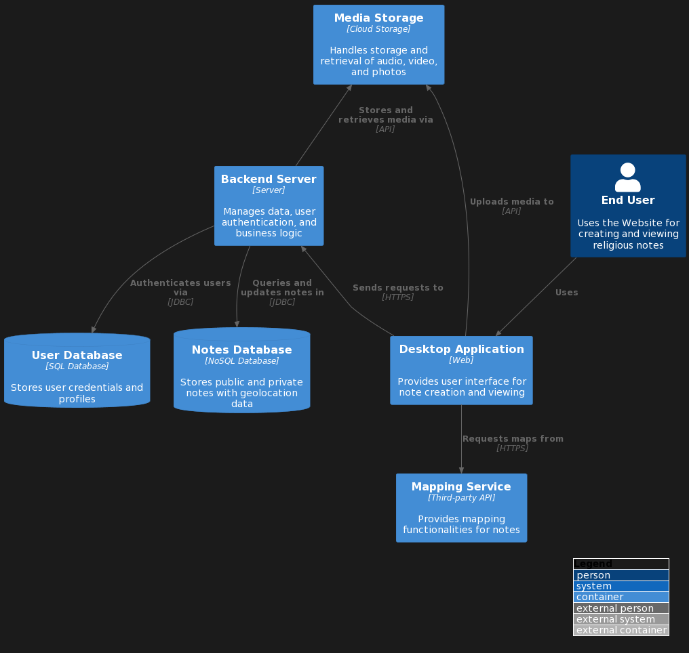

 

## Overview

Where's Religion? is conceptualized and designed for diverse users with interests in sharing media and notes about their respective encounters with "religion" in everyday places. Nearly all digital humanities scholarship in religion, theology, and adjacent fields perpetuates historical biases of text-based knowledge and media. While texts are no doubt essential to these fields, the premise of Where’s Religion? has been to create tools for acknowledging, analyzing, and interpreting religion as a multisensory and multimodal component of human life, both within faith traditions and beyond them in the fabrics of culture and society. We believe that it is time for our research methodologies to catch up with the realities of human experience and that creating a platform for collecting, organizing, and sharing images, videos, and sounds, along with textual notations, sourced from a wide range of users, is a necessary place to start. We also believe that the resulting collection of materials will be of immense value to American public life.

### Information

- **Source Code:** <https://github.com/oss-slu/lrda_website> 
- **Client** Dr. Adam Park
- **Current Tech Lead:** [Yash Bhatia](https://yashb196.github.io/yashb196/)  
- **Developers:**
  - Stuart Ray (capstone) 
  - Izak Robles (capstone) 
  - Josh Hogan (capstone) 

  - Varsith Reddy Legala (volunteer) 
- **Start Date:** 25 Aug 2023
- **Adoption Date:** 25 Aug 2023
- **Technologies Used:** 
  - Tech Stack:  React , TypeScript, JavaScript​​.
  - Key Languages: TypeScript, JavaScript​​​​.
  - Key Frameworks: Next JS, Tailwind CSS​.
  - Databases: Rerum Website​.
  - Critical Dependencies: Node.js, JavaScript, pnpm​​​​​​.
- **Type:** Desktop
- **License:** [MIT](https://opensource.org/license/mit/)

### User Guide

- End user will log into the application 
- When logged in there will be an option to either view global notes(notes that other people published) or view an empty page with a button on the left "Add Note" which will enable the user to create a note.
- once clicked on the button the user can then add a title (manditory) along with audio/video/photo/ tags(manditory) and text for the note 
- click on the top right icon to make it public
- if you still need it private go back.
- map will represent all the global notes and where it is generated (similar to the mobile application).
- user can search an entry based on the tags mentioned in the post.
, and link to the Where's Religion Documentation[detailed user-oriented documentation](https://github.com/oss-slu/lrda_website/blob/main/README.md).

## Technical Information

### Technical Overview

Overview of the software architecture.

Where’s Religion is an open-source mobile and desktop application that supports in-person research, remote data entry, media sharing, and mapping. To do this, the mobile app enables users to collect fieldnotes, images, videos, and audio files - all geotagged and timestamped. The desktop companion app provides a more feature-rich format to refine fieldnotes, make new entries, or, for certain user profiles, review or grade other users’ entries. When published, all entries are automatically curated on a publicly available, interactive map with search and filter functions for research. We have conceptualized and designed for students, researchers, and public users to document and share their respective encounters with “religion” in everyday life – all with the intended purpose of democratizing data collection and visualizing religious diversity at scale.

### Development Priorities

- There is user interface changes required which should follow (ShadCN)[https://github.com/shadcn-ui/ui]
- The Pages to add note/edit note should have the functionality to access photos and videos from local systems.
- The Map Page should be built based on either open street maps or leaflet.
- The notes should be fetched onto the home page.

## Get Involved

Overview of contribution and participation information, [contributors guide](https://github.com/oss-slu/lrda_website/blob/main/README.md)
