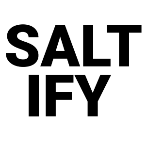
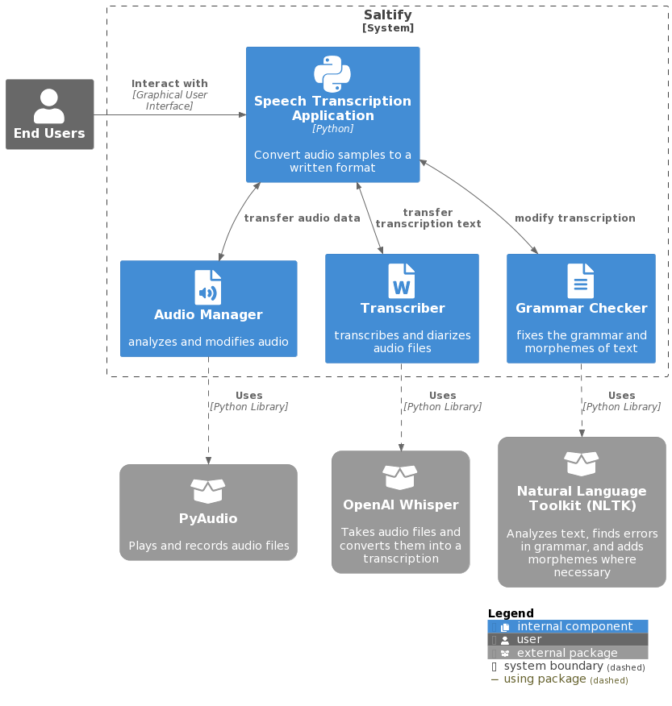

## Overview

 The primary purpose of the application is to transcribe an audio sample into a written format that is accepted by SALT software. SALT software is an app that analyzes the speech of children and scores it according to their metrics. The app can currently transcribe audio samples of a conversation between a child and an adult into text. Children naturally produce speech sound errors, language errors, and language features, such as disfluencies. Language errors and features are diagnostically meaningful to speech-language pathologists (SLPs) and need to be maintained in the transcription. Unlike any programs currently available, the app will also offer suggestions for coding the sample.

### Information

- **Source Code:** <https://github.com/oss-slu/SpeechTranscription>
- **Client:** Dr. Elizabeth Roepke and Dr. Sara Steele, Saint Louis University
- **Current Tech Lead:** [Logan Wyas](https://github.com/loganwyas)
- **Developers:**

  - [Omar Al Akkad](https://github.com/OmarAlAkkad) (alumni)
  - [Sean Gerty](https://github.com/gertysr) (alumni)
  - [Drew Hediger](https://github.com/ahediger) (alumni)
  - [Jake Wahle](https://github.com/jakewahle) (alumni)
  - [Colin Bush](https://github.com/cbush201) (capstone)
  - [Travis Herrick](https://github.com/TravisHerrick7) (capstone)
  - [Jack Pifer](https://github.com/JackPifer) (capstone)

- **Start Date:** September 23, 2022
- **Adoption Date:** September 23, 2022
- **Technologies Used:**
  - Python
    - Tkinter / Custom Tkinter
    - NLTK
    - PyAudio
  - SALT
- **Type:** Desktop
- **License:** [GNU General Public License v3.0](https://opensource.org/license/gpl-3-0/)

## Users

Upon running the software, you will first

## Technical Information

### Overview

Overview of the software architecture.

### Development Priorities

- Improve the user interface
- Add diarization to the transcription
- Fix the errors when adding morphemes
- Implement automated testing
- Address the freezing of certain processes

## Get Involved

If you would like to contribute to this project, please visit our [GitHub page](https://github.com/oss-slu/SpeechTranscription/) to create your own issues or pull requests.
